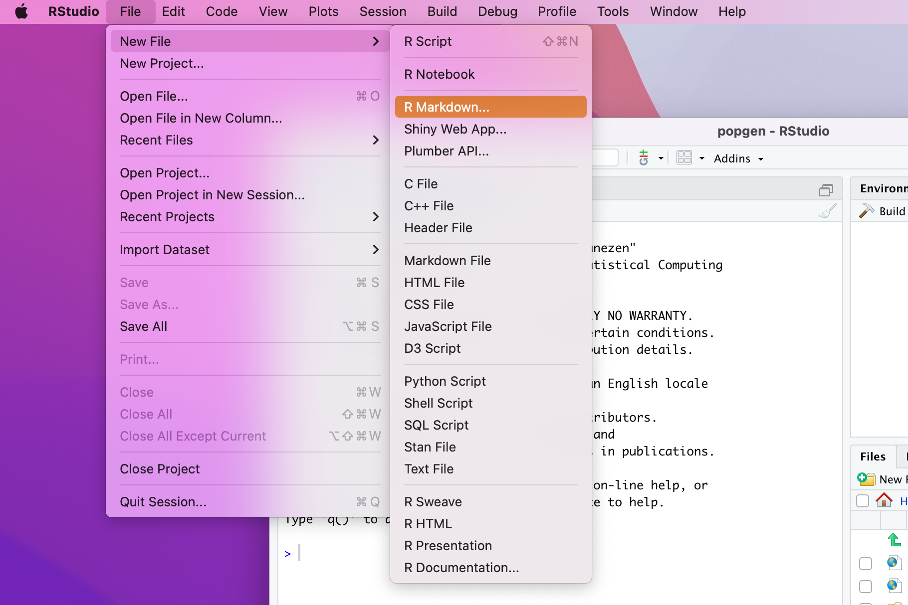
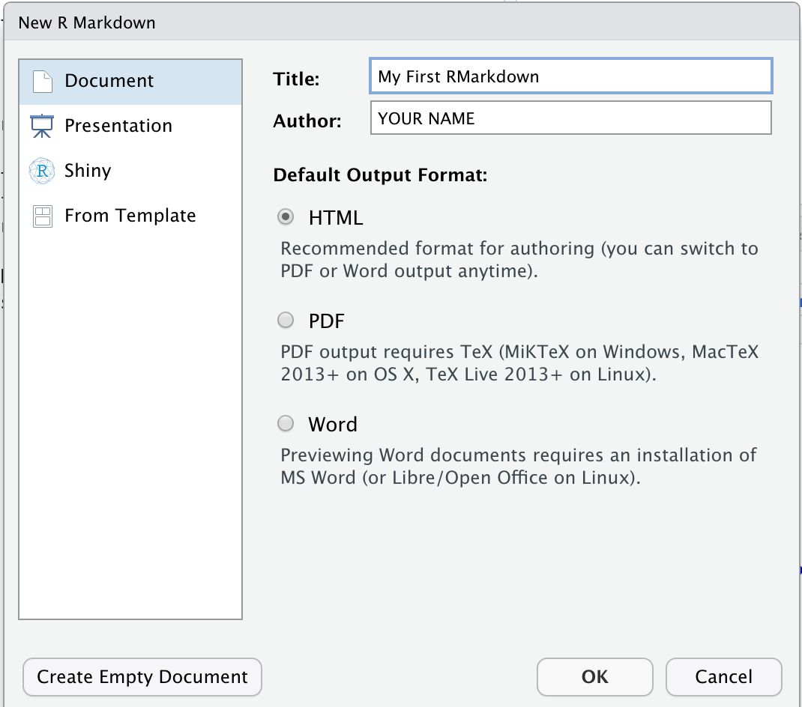
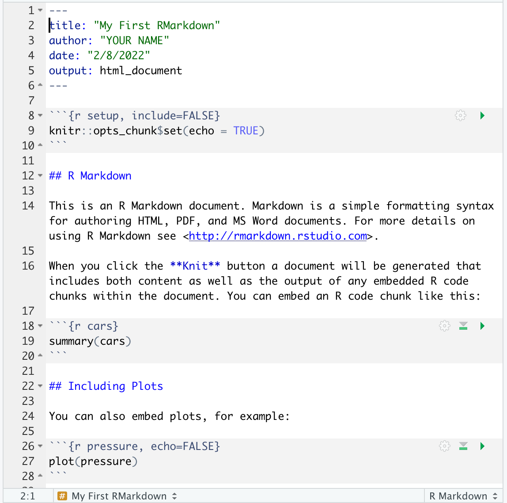
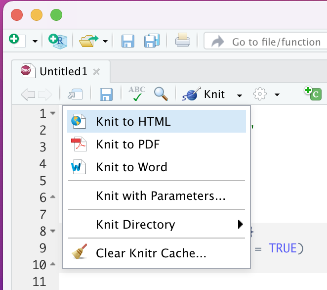
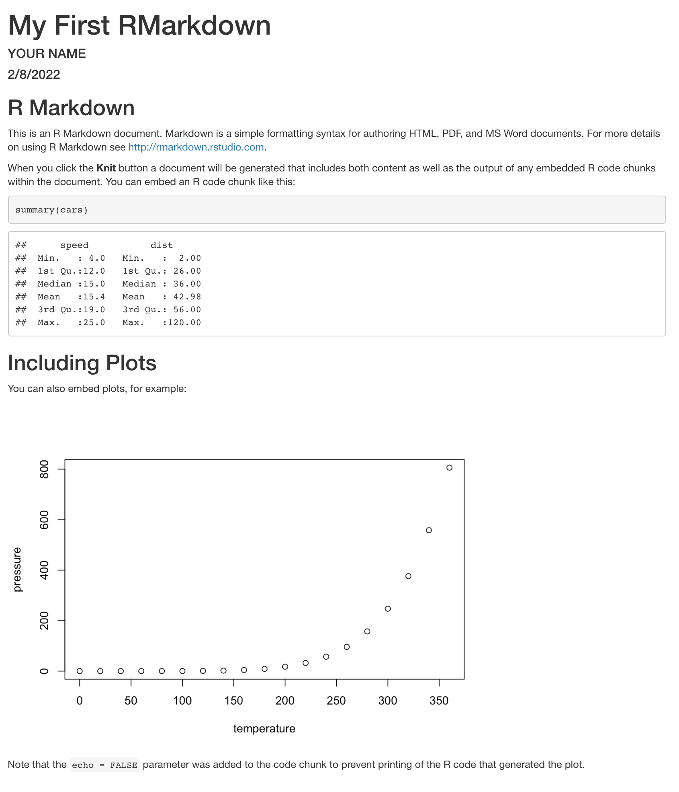

In this section, we will learn how to write and compile documents in the markup language named RMarkdown. The tutorials you went through earlier today were all written in Markdown and compiled in Rstudio.


## 1. Open a New RMarkdown Document in Rstudio


- In RStudio, choose ``File`` > ``New File`` > ``RMarkdown`` as shown below:

<br>

<center>

</center>


<br>

- This should present a dialogue box:

<br>

<center>

</center>


<br>

- Add relevant data as shown and click ``OK``. Your new document should then be open with some example data prefilled.

<br>

<center>

</center>


<br><br>


## 2. Basic Components of a Rmd Document

In this example, the document is prefilled with some example code.


<br>

### 2.1 Document Preamble

- The first section embedded between a pair of 3 dashes is called the document preamble:


```bash
---
title: "My First RMarkdown"
author: "YOUR NAME"
date: "2/8/2022"
output: html_document
---
```

- This is a basic preamble, but it can be modified to include additional commands as necessary.

- Also note the output format is listed as ``html_document``. You can always change it back to ``pdf_document`` if you need to later.


<br>

### 2.2 KNITR Compilation Chunk

- Immediately after the preamble you see a code snippet which is essential for compiling this document into whatever format you have chosen (html, pdf etc.). Don't worry too much about this for now. Just know that it is necessary to have it at the beginning of the document. ``knitr`` is a package that helps knitting your Rmd document into the chosen output format.


<br>

### 2.3 Section Headers and Text

- You can write headers at multiple headers and they begin with different number of ``#`` symbols.  For example:

	- ``#`` makes a top level header
	- ``##`` is a second level header.
	- So on and so forth.

- Text paragraphs can be formatted with very simple commands. For example, bold text is enclosed in a pair of double asterisks (``**``) and single asterisks are for italicized text.

- Links can either be written directly, or using the basic markdown format ``[link_text](https://actual_website.com)``.

<br>

### 2.4 Code Snippets

- This is where RMarkdown really shines. It takes all the code from your code snippet, executess it and prints the output within the document.  Let's look at some examples:

- The following chunk will load a package named ``cars`` into R and print a summary of that data set.

<pre>
```{r cars}
summary(cars)
```
</pre>


- This chunk will take the ``pressure`` dataset and make a plot based on it:


<pre>
```{r pressure, echo=FALSE}
plot(pressure)
```
</pre>


<br><br>


## 3. Knitting the Example Document

- Now that you have learned some basic RMarkdown concepts, let's see how we can compile/knit this document into HTML.

- In your RStudio menu bar, you should see a ``knit`` button. There is a dropdown arrow next to it. Click it. Then choose HTML.


<br>

<center>

</center>


<br>

- RStudio will knit that document and then open it inside the built-in viewer like below:


<br>

<center>

</center>

<br>


- Writing data analysis reports in RMarkdown will not only preserve your work but also make it reproducible. If you need to make changes, just go back to the Rmd file, edit it, save it, knit it and produce a new HTML/PDF document.

<br><br>


## 4. Home Work

- Create a new local git repository called ``rmd`` and a GitHub public repository with the exact same name.

- Generate a new RMarkdown file and document the following exercises in there:

	- Choose the ``mtcars`` data set in R using the ``data()`` function.

	- Create a new subset for cars that have 4 cylinders

	- Print this subset to the screen

	- Plot the relationship between gas mileage and engine displacement for the subset.

	- Make the same plot for engines with 6 cylinders.

- Knit the new RMarkdown file into HTML output

- Push all the files you have generated in this repository to your github repository (``rmd``)

- **Post your repository's full address to the Slack channel for this course**.


<br><br><br><br><br>
<br><br><br><br><br>
<br><br><br><br><br>
<br><br><br><br><br>
<br><br><br><br><br>
<br><br><br><br><br>
<br><br><br><br><br>


