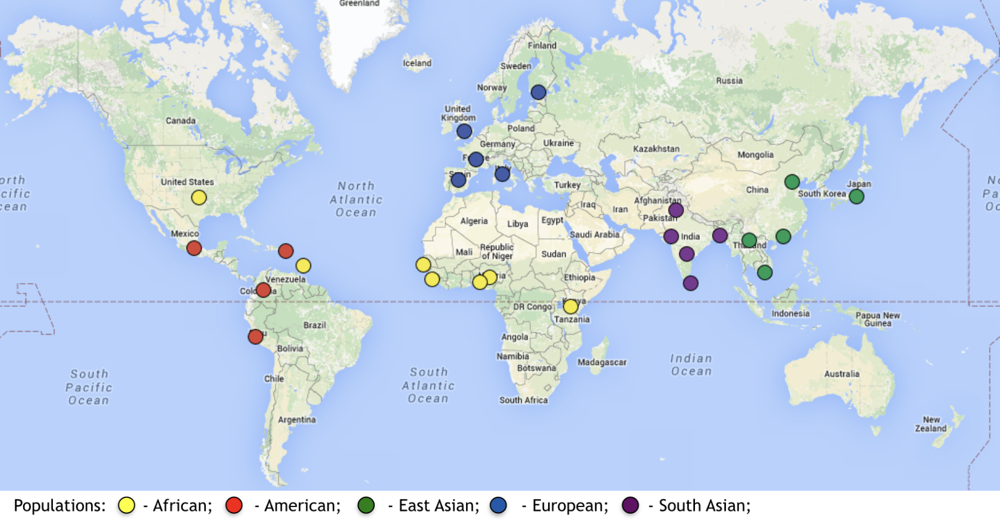
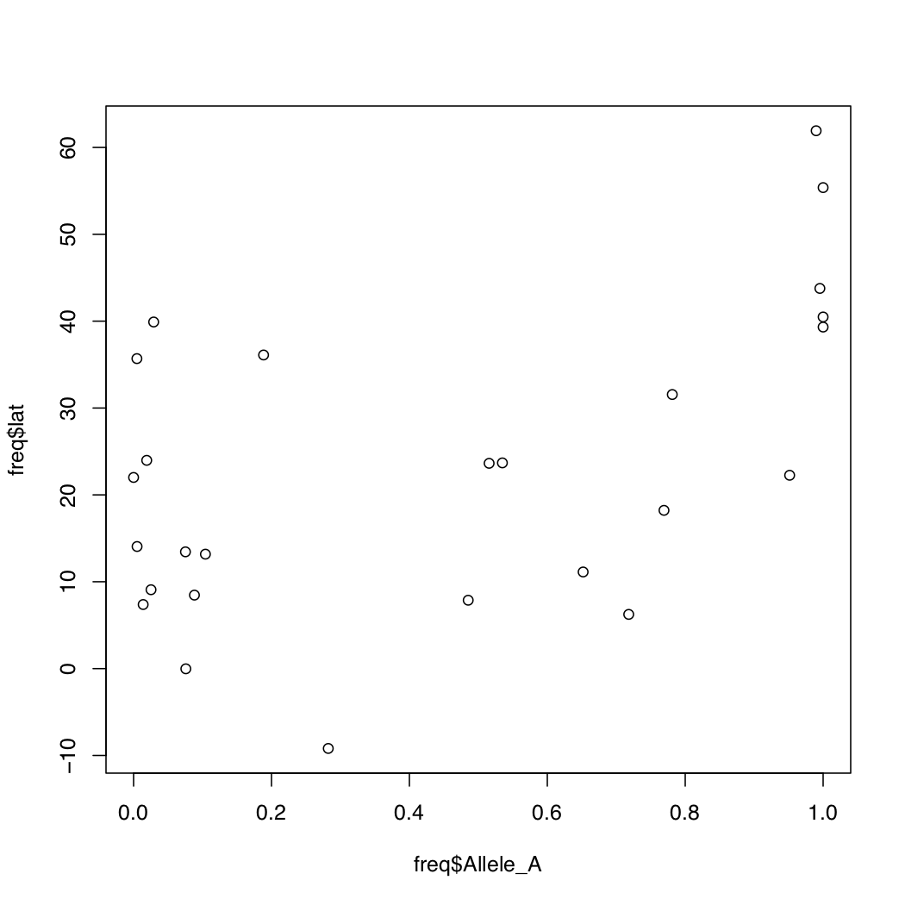
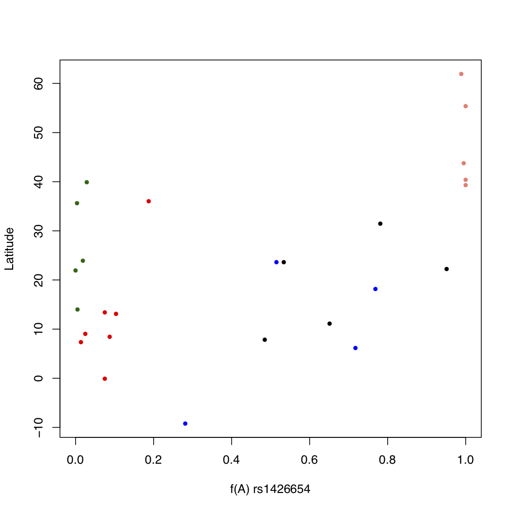
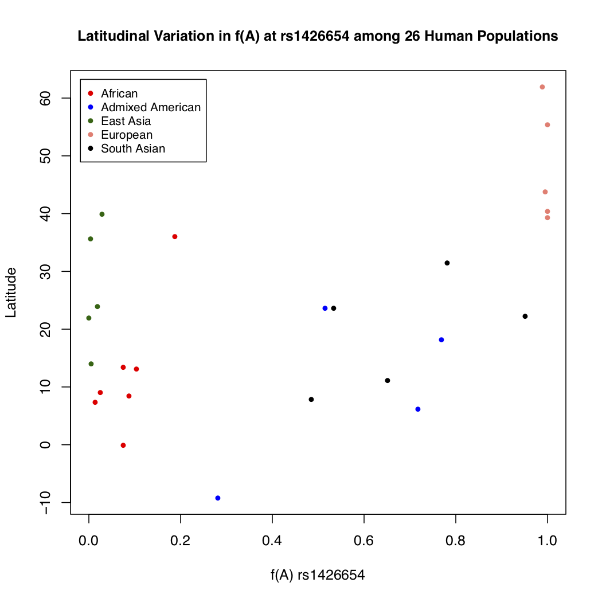
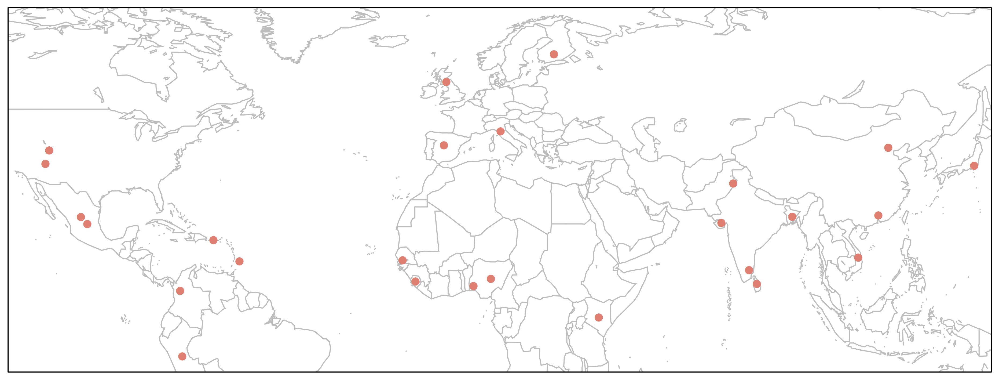
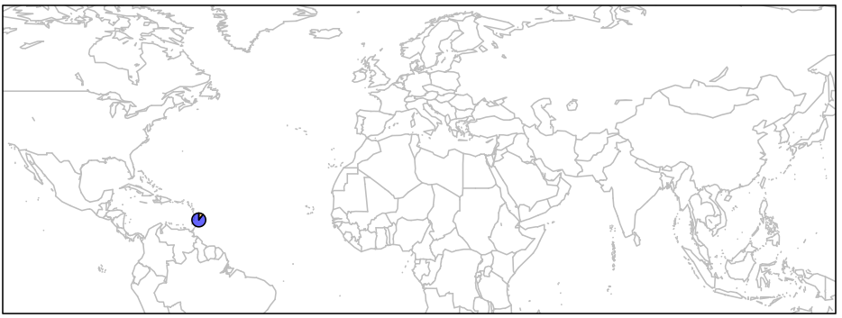
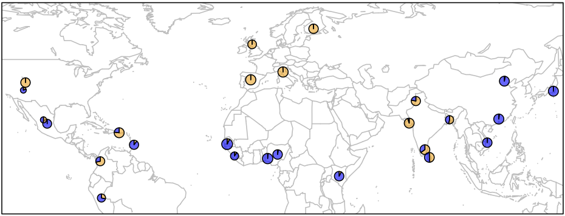
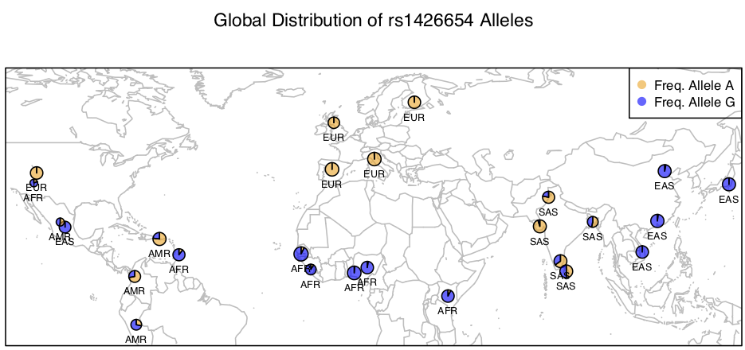

--- 
title: Human Population Genomic Variation
---


### Module 3 Instructions 

1. This is a self driven exercise

2. Please work in teams of two

3. Feel free to collaborate with the team next to you

4. Try to solve problems before asking for help

<br><br>

## Table of Contents

1. [Introduction to Data and Analysis](#introduction-to-data-and-analysis)

2. [Allele Frequencies and Population Demography](#allele-frequencies-and-population-demography)

3. [Combine All Frequency Files](#combine-all-frequency-files)

4. [The POPDATA File](#the-popdata-file)

5. [Join POPDATA with MASTER.FREQ](#join-popdata-with-master.freq)

6. [Exploratory Analysis of the Data Set](#exploratory-analysis-of-the-data-set)

7. [Geographical Maps](#geographical-maps)

8. [Allele Frequencies As Pie Charts](#allele-frequencies-as-pie-charts)

<br><br><br>

<a name="data"></a>

## 1. Introduction to Data and Analysis


Today's data is from [the 1000 Genomes project](http://www.internationalgenome.org/). This is an international consortium that started out with the goal of sequencing genomes of 1000 people around the world. Since then the project has accumulated variant data on several thousand individuals from the following populations:

<br>
<center>
 </img>
Image Credit: [1000 Genomes Project](http://internationalgenome.org) 
</center>
<br>


The data consists of allele frequencies at Single Nucleotide Polymorphisms (SNPs) in the human genome. For today's exercise, we are interested in only one SNP: ``rs1426654``. This SNP resides in a gene named **SLC24A5** which encodes a protein called **Na/K/Ca Exchanger 5** which greatly influences skin color in humans.  The leading hypothesis is that when our ancestors traveled out of Africa into Europe, the darker skin color was of no advantage in Europe's cold climate.  So eventually a new variant of the gene evolved in northern human populations which reduced the amount of skin pigmentation.  By comparing the frequency of the two forms (alleles) of this gene in various human populations, we can study how populations can adapt differently when they are subject to very different environments.

<br>

### 1.1 Goals for Today's Exercise

- Access allele frequencies data for locus ``rs1426654`` in 26 human populations

- Access location and demographic data on these populations

- Combine the two files to create a master data file

- Perform exploratory analysis on the data

- Generate a histogram of allele frequencies

- Generate a scatterplot of allele frequencies and population locations

- Install packages required for drawing a geographical map

- Create map showing locations of 26 populations

- Superimpose pie charts showing relative frequencies of two alleles at the given genetic locus in all 26 populations on the map


<br>


### 1.2 Data Access


- Before you can access data, you need to update your local repository:


```bash

cd ~/r4grads

git pull
```

- This command should fetch all the updates made to our class repository to your local computer and merge the changes with existing information. If you run into issues, talk to an instructor.


<br><br>


## 2. Allele Frequencies and Population Demography

- Navigate to the ``Module_3`` folder.


```bash
cd Module_3

cd data

ls -lh


-rw-rw-r--@ 1 vikram    81B Oct 28  2018 YRI.pop.frq
-rw-rw-r--@ 1 vikram    81B Oct 28  2018 TSI.pop.frq
-rw-rw-r--@ 1 vikram    80B Oct 28  2018 STU.pop.frq
-rw-rw-r--@ 1 vikram    80B Oct 28  2018 PUR.pop.frq
-rw-rw-r--@ 1 vikram    78B Oct 28  2018 PJL.pop.frq
-rw-rw-r--@ 1 vikram    80B Oct 28  2018 PEL.pop.frq
-rw-rw-r--@ 1 vikram    80B Oct 28  2018 MXL.pop.frq
-rw-rw-r--@ 1 vikram    81B Oct 28  2018 MSL.pop.frq
-rw-rw-r--@ 1 vikram    81B Oct 28  2018 LWK.pop.frq
-rw-rw-r--@ 1 vikram    82B Oct 28  2018 KHV.pop.frq
-rw-rw-r--@ 1 vikram    82B Oct 28  2018 JPT.pop.frq
-rw-rw-r--@ 1 vikram    80B Oct 28  2018 ITU.pop.frq
-rw-rw-r--@ 1 vikram    66B Oct 28  2018 IBS.pop.frq
-rw-rw-r--@ 1 vikram    81B Oct 28  2018 GWD.pop.frq
-rw-rw-r--@ 1 vikram    81B Oct 28  2018 GIH.pop.frq
-rw-rw-r--@ 1 vikram    66B Oct 28  2018 GBR.pop.frq
-rw-rw-r--@ 1 vikram    80B Oct 28  2018 FIN.pop.frq
-rw-rw-r--@ 1 vikram    81B Oct 28  2018 ESN.pop.frq
-rw-rw-r--@ 1 vikram    80B Oct 28  2018 CLM.pop.frq
-rw-rw-r--@ 1 vikram    81B Oct 28  2018 CHS.pop.frq
-rw-rw-r--@ 1 vikram    81B Oct 28  2018 CHB.pop.frq
-rw-rw-r--@ 1 vikram    66B Oct 28  2018 CEU.pop.frq
-rw-rw-r--@ 1 vikram    66B Oct 28  2018 CDX.pop.frq
-rw-rw-r--@ 1 vikram    80B Oct 28  2018 BEB.pop.frq
-rw-rw-r--@ 1 vikram    80B Oct 28  2018 ASW.pop.frq
-rw-rw-r--@ 1 vikram    80B Oct 28  2018 ACB.pop.frq
-rw-r--r--@ 1 vikram   1.6K Nov  5  2018 popdata
```


- There are 26 files containing allele frequency data and one file containing population demographic data. Let's take a quick peek inside both types of files:


```bash
cat YRI.pop.frq

pop	CHROM	POS	N_ALLELES	N_CHR	ALLELE1	FREQ1	ALLELE2	FREQ2
YRI	15	48426484	2	216	A	0.0138889	G	0.986111
```

- The file lists relevant details and frequencies of two alleles: A and G.  Each of the 26 files contain this type of data.

- Now check the popdata file:


```bash
cat popdata

pop     dist    superpop        lat     long    popname
ACB     13.19   AFR     13.1776 -59.5412        African_Carib_BBDS
ASW     -8.78   AFR     36.1070 -112.1130       African_Ancestry_SW_USA
BEB     23.68   SAS     23.6850 90.3563 Bengali_in_Bangladesh
CDX     22.01   EAS     22.0088 -100.7971       Chinese_Dai
CEU     62.28   EUR     39.3210 -111.0937       Utah_Resid_from_NWEurope
CHB     23.13   EAS     39.9042 116.4074        Han_Chinese
CHS     24.48   EAS     23.9790 113.7633        Southern_Han_Chinese
CLM     6.24    AMR     6.2442  -75.5812        Columbian_Medellin
ESN     10.22   AFR     9.0820  8.6753  Esan_in_Nigeria
FIN     61.92   EUR     61.9241 25.7482 Finnish_Finland
GBR     56.49   EUR     55.3781 -3.4360 Bri_England_Scotland
GIH     22.26   SAS     22.2587 71.1924 Guj_Ind_Houston
GWD     13.44   AFR     13.4432 -15.3101        Gambian_WestGambia
IBS     40.46   EUR     40.4830 -4.0876 Iberian_Spain
ITU     11.13   SAS     11.1271 78.6569 Telugu_Ind_UK
JPT     35.69   EAS     35.6895 139.6917        Jap_Tokyo
KHV     14.06   EAS     14.0583 108.2772        Kinh_Vietnam
LWK     -0.02   AFR     -0.0236 37.9062 Luhya_Kenya
MSL     8.46    AFR     8.4606  -11.7799        Mende_Sierra_Leone
MXL     23.63   AMR     23.6345 -102.5528       Mex_LA_USA
PEL     -9.19   AMR     -9.19   -75.0152        Peruvian
PJL     31.55   SAS     31.5546 74.3572 Punjabi_Lahore
PUR     18.22   AMR     18.2208 -66.5901        Puerto_Rican
STU     7.87    SAS     7.8731  80.7718 Sri_Lankan_Tamil
TSI     43.77   EUR     43.7711 11.2486 Toscani_Italy
YRI     10.16   AFR     7.3775  3.9470  Yoruba_Ibadan_Nigeria
```

<br><br>

## 3. Combine All Frequency Files


- Your goal is to combine all frequency data into a single file. 


```bash
cat *.frq > all.freq

head -n 6 all.freq

pop	CHROM	POS	N_ALLELES	N_CHR	ALLELE1	FREQ1	ALLELE2	FREQ2
ACB	15	48426484	2	192	A	0.104167	G	0.895833
pop     CHROM   POS     N_ALLELES       N_CHR   ALLELE1 FREQ1   ALLELE2 FREQ2
ASW	15	48426484	2	122	A	0.188525	G	0.811475
pop     CHROM   POS     N_ALLELES       N_CHR   ALLELE1 FREQ1   ALLELE2 FREQ2
BEB	15	48426484	2	172	A	0.534884	G	0.465116
```

### 3.2 Formatting the ``all.freq`` File

For our downstream visualization analysis, we need to get this file into correct format. You may have noticed that each allele frequency estimate has a header line. We do not need this redundant information for downstream analysis. Only one instance of the header line should be suffucient. We can selectively delete those redundant lines from the text file. 

We will use the program ``awk`` to copy out only even numbered lines from the file:


```bash
awk 'NR%2==0' infile > outfile
```

- Try this on the ``all.freq`` file. Note that you will need to name an output file.

- Once done, check the contents of the output file. It should look like the following.


```bash
cat outfile | head -n 10

ACB	15	48426484	2	192	A	0.104167	G	0.895833
ASW	15	48426484	2	122	A	0.188525	G	0.811475
BEB	15	48426484	2	172	A	0.534884	G	0.465116
CDX	15	48426484	2	186	A	0	G	1
CEU	15	48426484	2	198	A	1	G	0
CHB	15	48426484	2	206	A	0.0291262	G	0.970874
CHS	15	48426484	2	210	A	0.0190476	G	0.980952
CLM	15	48426484	2	188	A	0.718085	G	0.281915
ESN	15	48426484	2	198	A	0.0252525	G	0.974747
FIN	15	48426484	2	198	A	0.989899	G	0.010101
```

- We still need to insert a header line. The header you need is inside a file named ``header``.

- If you want to concatenate two files, you can use the ``cat`` command like below:

```bash
cat file1 file2 > output
```

- Try this out and name your output file ``master.freq``. Then check the contents of the output file again. 

```bash
cat master.freq | head -n 10

pop	CHROM	POS	N_ALLELES	N_CHR	ALLELE1	FREQ1	ALLELE2	FREQ2
ACB	15	48426484	2	192	A	0.104167	G	0.895833
ASW	15	48426484	2	122	A	0.188525	G	0.811475
BEB	15	48426484	2	172	A	0.534884	G	0.465116
CDX	15	48426484	2	186	A	0	G	1
CEU	15	48426484	2	198	A	1	G	0
CHB	15	48426484	2	206	A	0.0291262	G	0.970874
CHS	15	48426484	2	210	A	0.0190476	G	0.980952
CLM	15	48426484	2	188	A	0.718085	G	0.281915
ESN	15	48426484	2	198	A	0.0252525	G	0.974747
```

<br>


<br>

## 4. The ``popdata`` File


You will find this file also in the ``data`` subdirectory. It contains alphabetical list of population names whose lines correspond to those in allele frequency file. Check to make sure the file exists. This file also contains information on geographical locations of each of the 26 human populations we are studying. The populations are in turn grouped into 5 super populations.


```bash
cd data/

head popdata

pop     dist    superpop        lat     long    popname
ACB     13.19   AFR     13.1776 -59.5412        African_Carib_BBDS
ASW     -8.78   AFR     36.1070 -112.1130       African_Ancestry_SW_USA
BEB     23.68   SAS     23.6850 90.3563 Bengali_in_Bangladesh
CDX     22.01   EAS     22.0088 -100.7971       Chinese_Dai
CEU     62.28   EUR     39.3210 -111.0937       Utah_Resid_from_NWEurope
CHB     23.13   EAS     39.9042 116.4074        Han_Chinese
CHS     24.48   EAS     23.9790 113.7633        Southern_Han_Chinese
CLM     6.24    AMR     6.2442  -75.5812        Columbian_Medellin
ESN     10.22   AFR     9.0820  8.6753  Esan_in_Nigeria
```

<br>


## 5. Join ``popdata`` with ``master.freq``

The simplest way to accomplish this is use the ``cbind`` function in R.

- First read both files into R / Rstudio. Name the files ``freq`` and ``popdata`` respectively.

- Use the ``cbind`` function to join the two frames by columns into a single object called ``freq.df``

- After the join, your file should look like this:

```r
head(freq.df)

  pop CHROM      POS N_ALLELES N_CHR ALLELE1     FREQ1 ALLELE2    FREQ2 pop  dist superpop     lat      long                  popname
1 ACB    15 48426484         2   192       A 0.1041670       G 0.895833 ACB 13.19      AFR 13.1776  -59.5412       African_Carib_BBDS
2 ASW    15 48426484         2   122       A 0.1885250       G 0.811475 ASW -8.78      AFR 36.1070 -112.1130  African_Ancestry_SW_USA
3 BEB    15 48426484         2   172       A 0.5348840       G 0.465116 BEB 23.68      SAS 23.6850   90.3563    Bengali_in_Bangladesh
4 CDX    15 48426484         2   186       A 0.0000000       G 1.000000 CDX 22.01      EAS 22.0088 -100.7971              Chinese_Dai
5 CEU    15 48426484         2   198       A 1.0000000       G 0.000000 CEU 62.28      EUR 39.3210 -111.0937 Utah_Resid_from_NWEurope
6 CHB    15 48426484         2   206       A 0.0291262       G 0.970874 CHB 23.13      EAS 39.9042  116.4074              Han_Chinese
```


<br>


### 5.1 Exercise: Check file for correctness

- You want to make sure that the geographical data on a given line belongs to the population name mentioned. Note that there are two ``pop`` columns. You could check to see whether they match with each other.

- Use the ``==`` operator in R to check these two columns. For example:

```r
file$column1 == file$column2
```

- If the output is all ``TRUE`` then you are good. If you see even one ``FALSE``, retrace your steps backwards to find out where you made a mistake.


<br><br>


## 6. Exploratory Analysis of the Data Set

- In this section, you will generate some summary statistics of the data:

<br>

### 6.1 Exercise: Summary Stats

- Calculate following stats:

	- Check the range of values in ``latitude``, ``longitude`` using the ``range()`` function in R

	- Check min and max values of frequencies of both alleles using the ``summary()`` function


<br>


### 6.2 Exercise: Basic Plotting

- Generate a histogram of frequencies of each allele. For example:


```r
hist(freq.df$FREQ1)
```

- Try this command on the second allele


- Generate a scatterplot of ``FREQ1`` and ``lat`` (latitude).

```r
plot(freq.df$FREQ1, freq.df$lat)
```

<br>
<center>

</center>
<br>


- Now make this plot look better by setting the following parameters:

	- x axis label
	- y axis label
	- solid filled points
	- color the points
	- change the size of the points to ``0.8`` or ``1.2``
	


- Wouldn't it be nice if we colored data from each population differently?  Simply assign the column ``pop`` as a value to the ``col=`` argument.

- Now you have 26 different colors, each representing a different population. This suddenly looks messy instead of nice.  Let's look at a way to fix this problem.

<br>

### 6.3 Creating color palettes

- Note that our data set has a column called ``superpop`` which groups individual populations into one or more higher level pops.  We can make use of that.  What happens if you assign the ``col`` parameter to ``superpop``?


```r
plot(x, y, col=file$superpop)
```

- That's right, it doesn't work. R complains that it can't find a color called ``AFR``. In order to make this work, we need to create a new color panel:


```r
mypal <- c(AFR="red", AMR="blue", EAS="darkgreen", EUR="salmon", SAS="black")

mypal

        AFR         AMR         EAS         EUR         SAS 
      "red"      "blue" "darkgreen"   "salmono"     "black" 
```

- Now assign the color palette in the plot command:


```r
plot(x, y, col=mypal[file$superpop]
```

<br>
<center>

</center>
<br>


- Did it work? What did you learn?  

- Try experimenting by changing/swapping colors of the super populations and redraw the plot.

<br>

### 6.4 Exercise: Create Legend


- Now we have populations colored differently and grouped by super populations. But if you send this figure to someone they won't know what color represents what populations.

- This is where the ``legend()`` comes in.  Here is the syntax:


```bash
plot(...as above...)
legend(POSITION, WHAT_TO_INCLUDE_IN_THE_LEGEND, POINT_SIZE, COLORS, LEGEND_TEXT_SIZE, INSET_OR_NO)
```

- And here is an example:

```bash
legend('bottomright', c('African'), pch=1.2, col=c('red'), cex=0.8, inset=0.02)
```


- Did it work? If yes, how many populations are listed?  

- Now repeat the command by adding all the super populations and all associated colors.  You should see something like this:

<br>
<center>

</center>
<br>

<br>


## 7. Geographical Maps

- First, go ahead and install these packages. Once installed, load them.

	- ``maps``
	- ``mapdata``
	- ``scales``
	- ``mapplots``


- Second, create a RScript so that you won't be typing all commands over and over again.


<br>

### 7.1 Draw World Map Layer


```r
map('worldHires', xlim=c(-120,142), ylim=c(-12,72), col='gray', fill=FALSE)
```

- Keep in mind what the x and y values above are. They are longitudes and latitudes.

<br>
<center>
 </img>
</center>
<br>


### 7.1 Exercise: Plot Human Populations on the Map

- R provides a function called ``points()`` that allows you to plot points using x,y coordinates on the plot. 

- For example:

```r
plot()
points(x, y, pch=16, col="your_favorite_color")
```

- Try it out. Did it work? Do you know what to use for x and for y?

- If it worked, your map should now look like this:

<br>
<center>
 </img>
</center>
<br>


<br>


## 8. Allele Frequencies As Pie Charts


This would perhaps be the best way to depict our data on the map, because it will show relative frequencies of both alleles at every given geographical position (i.e. population).


First, let's just draw one pie to see how it works.  We can then apply the same principal to the remaining points on the map.


```r
map('worldHires', xlim=c(-120,142), ylim=c(-12,72), col='gray', fill=FALSE)

add.pie(z=c(0.104, 0.895), x=-59.5412, y=13.1776, radius=192/100, 
			col=c(alpha("orange", 0.6), alpha("blue", 0.6)), labels="")
box()
```

As you can see below, we just plotted the allele frequency data for the Barbados African population using a pie chart.  The orange and blue colors are representative of the frequencies of alleles A and T respectively.

<br>
<center>
</img>
</center>
<br>


### 8.1 Exercise: Plot All Pie Charts Using ``for{}`` Loop


In order to plot one pie chart per population of data, what we need to do essentially is to cycle through the code above for each row of our data frame ``freq.df``.  If you need a refresher in what was contained in that data frame, run a head on it quickly:


```bash

> head(freq.df)

  pop  dist superpop     lat      long                  popname CHROM      POS N_ALLELES N_CHR  Allele_A Allele_G
1 ACB 13.19      AFR 13.1776  -59.5412       African_Carib_BBDS    15 48426484         2   192 0.1041670 0.895833
2 ASW -8.78      AFR 36.1070 -112.1130  African_Ancestry_SW_USA    15 48426484         2   122 0.1885250 0.811475
3 BEB 23.68      SAS 23.6850   90.3563    Bengali_in_Bangladesh    15 48426484         2   172 0.5348840 0.465116
4 CDX 22.01      EAS 22.0088 -100.7971              Chinese_Dai    15 48426484         2   186 0.0000000 1.000000
5 CEU 62.28      EUR 39.3210 -111.0937 Utah_Resid_from_NWEurope    15 48426484         2   198 1.0000000 0.000000
6 CHB 23.13      EAS 39.9042  116.4074              Han_Chinese    15 48426484         2   206 0.0291262 0.970874

```


``for{}`` loops in R are notoriously slow for large data sets, but we have just got 26 iterations of the loop, so we do not need to worry about computational speed.  Loops in R are similar to those in bash or any other language and they take the following general form:


```r
for (i in 1:100){
  do something
}

```

This means run ``something`` command 100 times. Let's try some examples:


- Print numbers 1 to 10

```r
for (i in 1:10){
  print(i)
}
```

- Multiply each number between 200 and 220 by 3

```r
for (i in 200:220){
  print(i*3)
}
```

- Now that you understand how ``for()`` loop works, go ahead and apply it to your map code above so that you will have 26 pie charts one per population on the map.

- The solution to this problem is at the end of this page. But try to solve it by yourself first (with your partner). 

- Your goal is something akin to the following figure:

<br>
<center>
</img>
</center>
<br>

- Finally, add a legend to describe what each color represents, so that your final figure looks like this:


<br>
<center>
</img>
</center>
<br>


<br><br><br><br><br><Br>
<br><br><br><br><br><Br>
<br><br><br><br><br><Br>
<br><br><br><br><br><Br>
<br><br><br><br><br><Br>
<br><br><br><br><br><Br>
<br><br><br><br><br><Br>
<br><br><br><br><br><Br>
<br><br><br><br><br><Br>
<br><br><br><br><br><Br>
<br><br><br><br><br><Br>
<br><br><br><br><br><Br>
<br><br><br><br><br><Br>
<br><br><br><br><br><Br>
<br><br><br><br><br><Br>
<br><br><br><br><br><Br>
<br><br><br><br><br><Br>
<br><br><br><br><br><Br>
<br><br><br><br><br><Br>
<br><br><br><br><br><Br>
<br><br><br><br><br><Br>
<br><br><br><br><br><Br>
<br><br><br><br><br><Br>
<br><br><br><br><br><Br>
<br><br><br><br><br><Br>
<br><br><br><br><br><Br>
<br><br><br><br><br><Br>
<br><br><br><br><br><Br>
<br><br><br><br><br><Br>
<br><br><br><br><br><Br>
<br><br><br><br><br><Br>
<br><br><br><br><br><Br>
<br><br><br><br><br><Br>
<br><br><br><br><br><Br>
<br><br><br><br><br><Br>
<br><br><br><br><br><Br>
<br><br><br><br><br><Br>
<br><br><br><br><br><Br>
<br><br><br><br><br><Br>
<br><br><br><br><br><Br>
<br><br><br><br><br><Br>


### 8.2 Final Map R Code


```r
pdf('WorldPie_Final2.pdf', width=10, height=7)

map('worldHires', xlim=c(-120,142), ylim=c(-15,72), col='gray', fill=FALSE)


for (i in 1:26){
  add.pie(z=c(freq.df$FREQ1[i], freq.df$FREQ2[i]), x=freq.df$long[i], y=freq.df$lat[i], 
		radius=freq.df$N_CHR[i]/100, col=c(alpha("orange", 0.6), alpha("blue", 0.6)), labels="")
  i=i+1
}

text(freq.df$long, freq.df$lat, labels=freq.df$superpop, cex=0.5, pos=1)

box()

legend('topright', bty='1', c("Freq. Allele A", "Freq. Allele G"), pch=16, 
		col=c(alpha("orange", 0.6), alpha("blue", 0.6)), pt.cex=1, cex=0.7)

title(main="Global Distribution of rs1426654 Alleles", font.main=1, cex.main=0.9)

dev.off()
```


