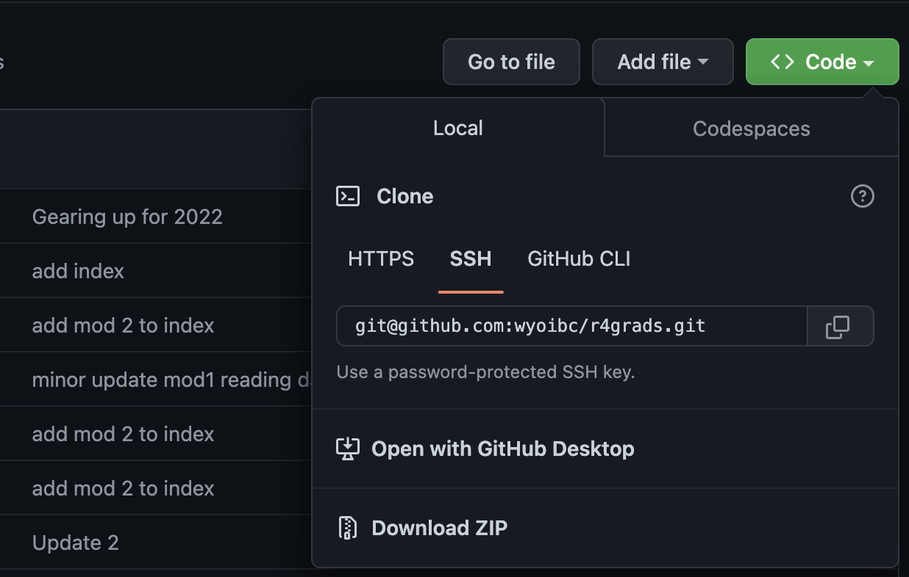

```{r setup, include=FALSE}
knitr::opts_chunk$set(echo = TRUE)
knitr::opts_knit$set(root.dir = "~/r4grads/Fish_data/Modified/")

```

<br>

[Home](https://wyoibc.github.io/r4grads/)

<br>
<br>

In this tutorial, we will explore some basic data manipulation in R, including reading, filtering, and transforming. These are essential steps for nearly all datasets, as data is rarely ever perfectly clean and formatted exactly right for all of the analyses that you're interested in.
<br>
I **highly** recommend writing all of your code in an R script and commenting it liberally. Even for relatively simple operations, if you need to repeat them or slightly tweak them, it's much easier to simply open up your script and re-run it or edit it than to re-type everything into R. Even more importantly, it ensures that there is a record of exactly what you did. If you haven't already dealt with trying to remember how you handled data when you come back it to after a while, you'll probably be surprised by just how quickly you can forget what you were doing and why.

How to open a script is detailed in the intro to R tutorial.

<br>

* When there are large spaces in this tutorial, this indicates places where you should try to figure out how to code something. If you keep scrolling down, you'll find the solution, but you'll get a lot more out of it if you make a solid attempt to solve the problems yourself first.

<br>
<br>

### Reading in the data

<br>

Before we can work with the data, we need to download it. Go to the Github repository for this workshop: [https://github.com/wyoibc/r4grads](https://github.com/wyoibc/r4grads) and click on the green `Code` button, then on the `Download ZIP` button. (You can alternately clone the repo if you're familiar with git). You can also download the individual files from [here](https://github.com/wyoibc/r4grads/tree/master/Fish_data/Modified) if you know how to do that.

{#id .class width=50% height=50%}\

<br>

Start by setting our working directory. If you set things up exactly as I did, then this path will work for you. If not, then you'll need to edit this path:

```{r, eval = FALSE}
setwd("~/r4grads/Fish_data/Modified/")
```

**Again, make sure this points to the correct path for you, not my path.**

<br>

Then read in the data. Here, we have the data in two separate csv files for different data pertaining to some fish. One file is body size data with some information about sampling and the species, and the other file contains stable isotope data.

```{r}
body <- read.csv("Fish_body_size.csv")
iso <- read.csv("Fish_isotopes.csv")
```
<br>

Let's take a quick look at the top few rows of each dataset.


```{r}
head(body) # Check the top or head of a dataset
head(iso) # if you're not familiar, anything after '#' is a comment and not interpreted by R, it's there just as your own notes on what you're doing. Use them.
```
<br>
We can also look at the bottom few rows.
```{r}
tail(body)
```
<br>
See how many rows and columns are in each dataframe:

```{r}
dim(body) # get the dimensions of 'body' dataset
dim(iso) # get the dimensions of the 'iso' dataset
```

<br>
<br>
Let's take a look at what species are included and how many samples we have of each species.

```{r}
unique(body$Species)

summary(as.factor(body$Species))
```


**What is summary telling us? Do you notice any potential problems with the data from running the previous two commands?**

<br>
<br>
<br>
<br>
<br>
<br>
<br>
<br>
<br>
<br>
<br>
<br>
<br>
<br>
<br>
<br>


### Fixing spelling

Looking at either of those last outputs, you should notice that we have some misspellings. In some cases, "Coho" was written in all capital letters, and because R is case sensitive (as are most other coding languages), these are interpreted as different species. We also have "Dolly Varden" abbreviated down to just "Dolly" in one case, and a misspelling of "Steelhead" as "Steelhesd". We will want to correct these before we move forward with any further data processing.

<br>

There are a few ways to do this. One is by using an indexing approach to identify all of the elements of the objects that contain the values we want to replace, and replacing them with the values we want.

<br>

Let's build this out:

<br>

We'll start by identifying which elements of the "Species" column of `body` contains `"COHO"`

```{r, results = FALSE}
body$Species=="COHO"
```
<br>

You should see a long list of TRUE/FALSE values corresponding to whether each element is (TRUE) or is not (FALSE) "COHO". We can then use this to select out only the TRUE elements of `body$Species`:

```{r, results = FALSE}
body$Species[body$Species=="COHO"]
```

<br>
<br>

And finally, using that indexing to identify the incorrect entries, we can replace them with "Coho":
```{r}
body$Species[body$Species=="COHO"] <- "Coho" # replace all instances of COHO with Coho
```

<br>
<br>
<br>

But there are also much faster ways to do this. The function `gsub()` performs pattern matching and replacement. One of the most essential skills in R is learning how to use new functions. If you already know what function you want to use, you can `?` before a function to get the built-in help documentation. Try it out: 

```{r}
?gsub()
```

<br>

* Note that if you are trying to get help for a function that is not in base R, but contained in a specific package, you'll need to have that package loaded to use `?`. You can use `??` to search in all installed packages, even those not currently loaded.

<br>

As is the case for many functions, `gsub()` has several options that are set to defaults that we won't worry about, we only really care about the first few options here most of the time. 
<br>
<br>

**From looking at this help menu, how would we would replace occurrences of "Steelhesd" with "Steelhead" in `body$Species`?**


<br>
<br>
<br>
<br>
<br>
<br>
<br>
<br>
<br>
<br>
<br>
<br>
<br>
<br>
<br>
<br>
<br>
<br>
<br>
<br>
<br>
<br>
<br>
<br>


```{r}
body$Species <- gsub("Steelhesd", "Steelhead", body$Species)
```

What if we want to replace "Dolly" with "Dolly varden"? Try it out.

<br>
<br>
<br>
<br>
<br>
<br>
<br>
<br>
<br>
<br>
<br>
<br>
<br>
<br>
<br>


I'm guessing that you used something like:

```{r}
body$Species <- gsub("Dolly", "Dolly varden", body$Species)
```

Take another look at the data and let's see if we've cleaned up the species names

```{r}
unique(body$Species)
summary(as.factor(body$Species))
```

<br>

**Do you notice any problems?**

<br>
<br>
<br>
<br>
<br>
<br>
<br>
<br>
<br>
<br>
<br>
<br>
<br>
<br>


What you should notice is that we replaced ALL instances of "Dolly" with "Dolly varden", so what was previously "Dolly varden" is now "Dolly varden varden". What we should have done was the following:

```{r}
body$Species <- gsub("^Dolly$", "Dolly varden", body$Species)
```

<br>

In the above, the `^` indicates the start of a string and the `$` indicates the end of string of a string, indicating that only want to replace Dolly when the D is the start of a string and the y is the end. We could go back to the start, read the data back in from scratch and run the above line, but let's fix "Dolly varden varden" in the existing object now.
<br>
<br>

**Try out turning "Dolly varden varden" back into "Dolly varden**


<br>
<br>
<br>
<br>
<br>
<br>
<br>
<br>
<br>
<br>
<br>
<br>
<br>
<br>
<br>
<br>
<br>
<br>
<br>
<br>


There are a few options for doing this:
```{r}
body$Species <- gsub("^Dolly varden varden$", "Dolly varden", body$Species)
# OR
body$Species <- gsub("varden varden", "varden", body$Species)
# OR
body$Species[body$Species=="Dolly varden varden"] <- "Dolly varden"
```


If we take a look at the data again, we should see that these errors have been corrected:

```{r}
unique(body$Species)
summary(as.factor(body$Species))
```

<br>

We should also know how many species we sampled, and we can check how many are in this dataset:

```{r}
length(unique(body$Species))
```

<br>

We also have a similar error in `body$Site` that we'll fix real quick. This one is not as obvious, but if you run: 
```{r}
sort(unique(body$Site))
```

you might notice "RT02-R" and "RT02R" and "RT02-BP" and "RT02BP".  

**Replace "RT02-R" with "RT02R" and "RT02-BP" with "RT02BP".**

<br>
<br>
<br>
<br>
<br>
<br>
<br>
<br>
<br>
<br>
<br>
<br>
<br>
<br>
<br>
<br>
<br>
<br>
<br>


```{r}
body$Site <- gsub("RT02-R", "RT02R", body$Site)
body$Site <- gsub("RT02-BP", "RT02BP", body$Site)
```


These look pretty good now. Note that misspellings like these are relatively easy to catch, but incorrect numerical values can be much harder. Those errors will typically require plotting of the data to identify obviously incorrect values, which we'll cover later on. 

<br>
<br>

### Merging the data

Before we continue on, we'd like to have all of our data in a single object. This is simpler to keep track of and also allows us to apply filters and manipulations to the entire dataset at once, rather than needing to modify each object individually.

When merging, datasets may not include the same exact samples or samples may be in different orders, so we can't just stick the columns all together.  

**Take another look at the dimensions of our two data objects like we did at the start.**  

You'll notice that they have different numbers of rows, indicating that at least one sample is in one set but not the other.

<br>

We can check for `Fish.code` elements that are in the body size data but not the isotope data:

```{r}
which(!body$Fish.code %in% iso$Fish.code)
```

the `%in%` operator checks for occurrences of the preceding object in the following object, and returns a vector of TRUE/FALSE. The `!` at the beginning reverses TRUE/FALSE, so that TRUE instead corresponds to elements of `body$Fish.code` that are NOT in `iso$Fish.code`, and the `which()` gives us the numeric indices of the elements of the TRUE/FALSE vector that are true. The result is that the numbers this spits out are the indices of `body$Fish.code` that are NOT in `iso$Fish.code`.

We can use this as an index to get the actual values of `body$Fish.code` that are not shared by `iso$Fish.code`:

```{r}
body$Fish.code[which(!body$Fish.code %in% iso$Fish.code)]
```

and we can run the same check in reverse order to see values of `iso$Fish.code` not in `body$Fish.code`:

```{r}
iso$Fish.code[which(!iso$Fish.code %in% body$Fish.code)]
```


We can see that we have a total of 9 samples that are present in one of the datasets, but not the other. We can identify which fish are in both datasets:

```{r, results = FALSE}
in_both <- intersect(iso$Fish.code, body$Fish.code)

in_both
```

Then we can use that to subset both of the datasets down to only these shared samples, both in the same row order. `match()` will give us the positions of it's first argument in it's second, and we'll use that to make sure that rows of both objects are in the same order as `in_both`.

```{r}
iso_red <- iso[match(in_both, iso$Fish.code), ]
body_red <- body[match(in_both, body$Fish.code), ]
dim(iso_red)
dim(body_red)
```

<br>


Both of these objects now have the same number of rows, and we know that they are in the same row order because we indexed them both from the `in_both` object in the same way. 

**Note that when indexing a dataframe or other objects that have both rows and columns, we index using a `[row,column]` format.** If we are selecting all columns, we can simply leave the portion after the comma blank, but we must still include the comma. The reverse is true for selecting all rows and certain columns.

We can now simply bind these columns together:

```{r}
all_data1 <- cbind(body_red, iso_red)
head(all_data1)
```


This leaves us with two "Fish.code" columns, however. We can can use the numeric index of the second of these to drop out the column that we don't need:

```{r}
all_data2 <- all_data1[,-7]
head(all_data2)
dim(all_data2)
```

<br>

This looks better. This is a fairly long and tedious way of combining dataframes, though. We can actually achieve all of this with a single function:

```{r}
all_data <- merge(body, iso)
head(all_data)
dim(all_data)
```

This has the same dimensions as the way that did this above using indexing and `cbind`. Looks good. Before we continue on, let's write this to a csv file. Then we can easily read this cleaned and merged data into R or another program anytime we want without having to repeat these steps:

```{r}
write.csv(all_data, "fish_data_merged.csv")
```

<br>
<br>

### Further filtering and subsetting examples

Read that .csv file back into R just to demonstrate that we have successfully written out the data.


```{r}
all_data <- read.csv("fish_data_merged.csv")
```

For some analyses, we might want to analyze a single species of fish at a time.

**Make an object called `coho_data` that contains the rows of `all_data` for only Coho observations.**

<br>
<br>
<br>
<br>
<br>
<br>
<br>
<br>
<br>
<br>
<br>
<br>
<br>
<br>
<br>
<br>
<br>
<br>
<br>
<br>
<br>
<br>
<br>


```{r}
coho_data <- all_data[all_data$Species == "Coho",]
head(coho_data, n=4)
```

<br>

We could simultaneously select out a single species and only the `Fish.code` and `Fork.length..cm.` columns.

```{r}
coho_length <- all_data[all_data$Species == "Coho", c("Fish.code", "Fork.length..cm.")]
head(coho_length, n=4)
```

We can select two or more species at once in a couple different ways:

```{r, results = FALSE}
cs_data <- all_data[all_data$Species %in% c("Coho", "Steelhead"),]

cs_data
```

<br>

Or using more complex pattern matching:

```{r, results = FALSE}
cs_data1 <- all_data[all_data$Species == "Coho" | all_data$Species == "Steelhead",]

cs_data1
```

where the pipe `|` indicates that we want to match the first condition or the second condition.

<br>

We can also use `&` to get only rows that satisfy two or more conditions. E.g., we can find the Coho that are smaller than 10 g:

```{r, results = FALSE}
coho_small <- all_data[all_data$Species == "Coho" & all_data$Weight..g. < 10,]

coho_small
```

<br>
<br>


### Transforming data

R makes it very easy to transform or otherwise convert data. Operations can be applied across entire vectors or columns of dataframes easily. We can easily log-transform our body size data:


```{r}
log_weight <- log(all_data$Weight..g.)
```

**Take this object that contains the logged weights and make a new object called `data_w_log` that contains `all_data` with `log_weight` as an added column. **

<br>
<br>
<br>
<br>
<br>
<br>
<br>
<br>
<br>
<br>
<br>
<br>
<br>
<br>
<br>
<br>
<br>
<br>
<br>
<br>
<br>
<br>
<br>
<br>
<br>
<br>


```{r}
data_w_log <- cbind(all_data, log_weight)
```


### Handling NAs (not applicable/empty data)

R treats NA (not applicable) data differently than other types of data. For this reason, we need special tools if we want to remove NA. To demonstrate this, let's first introduce some NAs into our data. 


**Convert all values of "Fork.length..cm." less than 5 to NA.** You should be able to figure this out by looking at when we used indexing to replace species misspellings and when we subsetted by values of `Weight..g.`.

<br>
<br>
<br>
<br>
<br>
<br>
<br>
<br>
<br>
<br>
<br>
<br>
<br>
<br>
<br>
<br>
<br>
<br>
<br>
<br>
<br>


```{r, results = FALSE}
all_data$Fork.length..cm.[all_data$Fork.length..cm. < 5] <- NA

all_data$Fork.length..cm.
```

<br>
<br>

If we try to check if values are NA the same way that we've evaluated things so far, it won't work:

```{r, results = FALSE}
all_data$Fork.length..cm.==NA
```

And in fact, if you're using RStudio and put the above line in a script, it will flag that line and mousing over the exclamation mark will tell you to use `is.na()`. Let's try that instead:

```{r, results = FALSE}
is.na(all_data$Fork.length..cm.)
```

<br>

This looks like what we'd expect, and we can use this to filter out NAs in this row. Note that many functions can include NA values, so completely removing NA data may not always be desirable. It will depend heavily on your specific dataset.

```{r}
data_noNA <- all_data[!is.na(all_data$Fork.length..cm.),]
```

Notice the `!` in the above line that lets us keep everything that is *not* NA. Now if we check if we have any NAs in the `Fork.length..cm.` of this new object, we should not get any:

```{r}
which(is.na(data_noNA$Fork.length..cm.))
```


<br>
<br>

[Home](https://wyoibc.github.io/r4grads/)

<br>
<br>