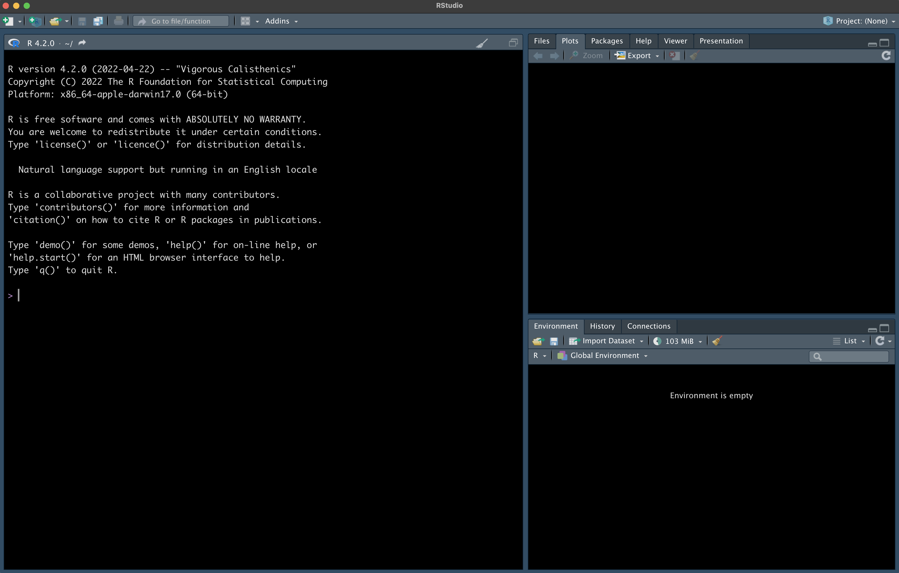
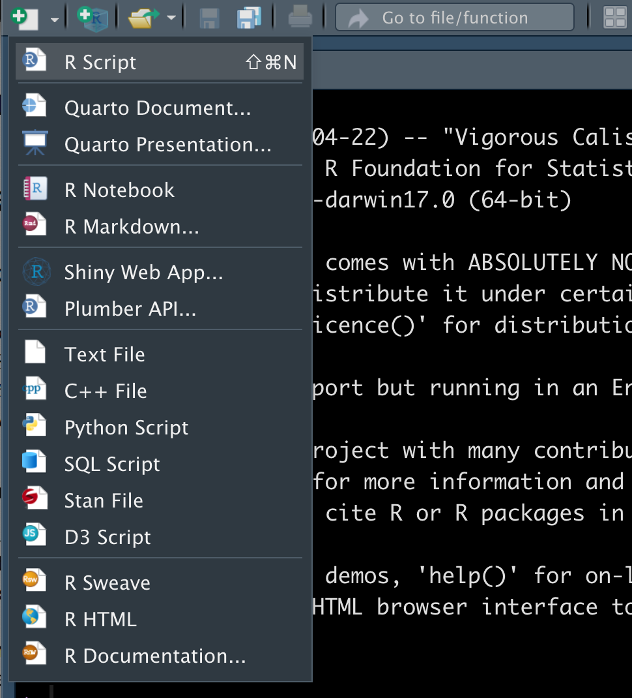
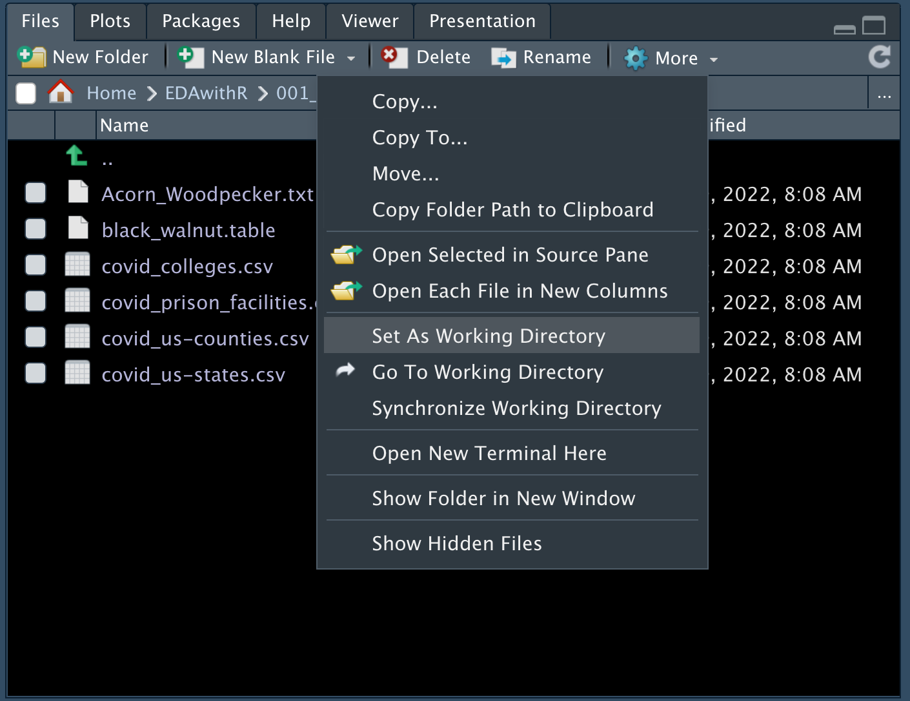

```{r setup, include=FALSE}
knitr::opts_chunk$set(echo = TRUE)
```

<br>

[Home](https://wyoibc.github.io/r4grads/)

<br>
<br>

## What is R?

R is a programming language for data analysis and visualization. R is open source, meaning that the code that underlies it is open to the public and can be modified by anyone. It is also free.

You can read more about R in the developers' own words [here](https://www.r-project.org/about.html).

In its most basic implementation, R is a command line program and looks like this:

{#id .class width=80% height=80%}\

This means that you only type commands into R, there is no point and click functionality. However, we will be using RStudio. RStudio is an integrated development environment (IDE) which is a much more friendly way to interface with R and does include some limited ability to point and click. 

Coding can be tricky to learn at first. Things like specifying how to make a plot by typing out lines of code can seem cumbersome and slower than clicking some buttons in Excel, but there are major advantages to coding a task, even if you could accomplish it using some other interface that you can interactively click your way through. One of the biggest advantages is that you can save all of your code in a script and then re-execute it at any time, which we'll talk about more below.

<br>

## Getting oriented in RStudio

As stated above, we'll be using RStudio. When you open RStudio for the first time, you should see something that looks roughly, but not exactly, like this:


{#id .class width=70% height=70%}\


Note that I've changed the color of my interface and I think I changed the orientation of the two panes on the right. This is just personal preference and has no functional implications.

<br>

The pane on the left is the R console that actually runs R code. We can type code straight into the console on the line with the `>` and hit `enter` to run a line. Let's try that quickly: type the following into the console and run it:

```{r}
3+3
```

* Note that here and throughout these tutorials, blocks of code will appear in gray boxes, with output from R immediately following it (in most cases) in a white box with `##` at the left side of each line of output.

<br>

We could entirely interact with R in this way, but that defeats the purpose of using RStudio. RStudio's single most useful feature (in my opinion at least) is that it makes it very easy to develop and run R scripts.

<br>

## Starting an R script

While you *could* type all of your code directly into the console in RStudio, lines of code that you type into the console quickly disappear and there is no good record of what code you ran before, nor is there any good way to modify old code code for new purposes.

I **HIGHLY** recommend that you put all of your code into a script whenever you code in R (and any other languages). A script is just a text file that contains commands for R (or another language). When you put all of your commands into an R script and save it, you keep a permanent record of what you did. This helps you remember what you did; lets you replicate what you did or slightly tweak what you did if you need to redo it, make small changes, or run the same operations on a different dataset; and allows you to share your code with others so that others can replicate your science.

If you haven't done much coding before, you'll be surprised just how fast you can forget everything you did, and even more importantly, why you did it. Well commented scripts avoid (or at least massively mitigate) this problem. I pretty much only type commands directly into the console if I'm running quick checks or getting help. Anything that I actually do to process or plot data goes into the script.

To create a new R script, click on the little `+` button in the top right of RStudio and click on `R script`:

{#id .class width=45% height=45%}\

<br>

This will open a new window with an empty R script. You can type all of your code into here. Once you type a line of code, you can run it by hitting `command return` if you are on a Mac or `ctrl return` if you are on Windows while your cursor is anywhere in that line. You can also highlight entire blocks of code or portions of a single line and run the selected code the exact same way.

To save your R script, go up to `file` in the menu bar (possibly at the top of your screen, above your RStudio window) and select `save as`.

In your script, anything that you type after `#` will be treated as a comment, meaning that R will not try to run it. This allows you to include information about what you're running and why as a reference for your future self and anyone that you might share the code with. For an idea of how I structure R scripts and use comments, take a look here: https://github.com/seanharrington256/Lgetula_gbs/blob/master/04_R_analyses/Lgetula_pop_assignment.R   

This is a single script from the Github repository for one of my manuscripts on kingsnake population genetics. This script does a lot of things in a large loop over multiple datasets, and would be pretty hard to figure out without lots of comments. Readability is particularly important here because this is publicly available code that accompanies the manuscript so that others can replicate my analyses if they choose.

* Note that while you'll probably most often want to interact with an R script in RStudio, an R script is just a plain text file, and can be opened with any editor that works with these files (e.g., bbedit, notepad++, etc.). Do not use word processors like Miscrosoft Word to look at or edit a script, though. On top of not displaying scripts well, these programs can easily change characters in a script into characters that looks similar but that are not interpreted the same by R (e.g., ` and '). 

<br>

## Basic math

About the simplest way to use R is as a fancy calculator. In your script, type the following, then use `command enter` or `ctrl enter` to execute the line from the script in the R console:

```{r}
3+7
```

Get used to typing commands in your R script and then running them in the R console, we'll be doing this a lot.

<br>

R can do all sorts of math:


```{r}
3+7 # addition
5-23 # subtraction
86*63  # multiplication
33/11 # division
4^2 # exponents
```


<br>
<br>


The vast majority of what you'll want to do in R will use functions rather than simple mathematical operators. A function is just some piece of code that performs a set of operations on whatever input you provide. Functions are named and always followed by `()`

If we want to take the logarithm of a number we can use the `log()` function.

```{r}
log(10)
```

Note that the default base of the `log()` function is *e* for the natural log. If we want to change that and get the log using base 10 instead, we can specify that as another **argument** in the function -- arguments are the inputs and options for a function, and many functions have many possible arguments. In most cases, any arguments that are not explicitly specified by the user will be set to some default.

If we want to see the arguments for `log()` or get other help and information about the function, we can run:

```{r}
?log()
```

Based on this help menu, how would we specify that we want to use 10 (or some other number) as the base?


<br>
<br>
<br>
<br>
<br>
<br>
<br>
<br>
<br>
<br>
<br>
<br>
<br>
<br>
<br>
<br>
<br>
<br>
<br>
<br>
<br>
<br>


```{r}
log(10, base = 10)
```


This is great, but for coding to be useful, we need to be able to work with data without just typing in numbers. This is where objects come in.

<br>

## Objects

R is an object-based language. It stores data in memory as "objects" that the user can manipulate using the names of the objects. Data are assigned to objects using the `<-` operator.

<br>

We can use this to assign a single value to an object:

```{r}
num <- 3
```

The object named `num` now contains the value 3. We can execute the object in the console to see what it contains and confirm that it's 3:

```{r}
num
```

Now we can use this object as we would the number 3:

```{r}
80-num
```

<br>

We can also assign the ouput of an operation or function to an object:

```{r}
num_2 <- 9*256
num_3 <- num + num_2
num_4 <- log(num_3)
```

We can also assign character strings or TRUE/FALSE values to objects:

```{r}
some_text <- "character string"
sometruefalse <- TRUE
```


These aren't very informative object names - you usually want to strike a balance between using informative names that help you remember what's in an object while trying not to have object names be overly long.

<br>

## Types of objects

We aren't restricted to objects that contain only a single value: some objects contain large amounts of data.

<br>

#### 1. Vectors:

Vectors are just a series of values - these can be numbers, characters, TRUE/FALSE, whatever. An important part of vectors is that hey have a single dimension: they do not have columns and rows, they are just a series of values.

```{r}
months <- c(1, 2, 3, 4, 5, 6, 7, 8, 9, 10, 11, 12)

months
```

Note how the `c()` or concatenate function allows you to create a vector.

<br>

You could have created this exact same vector another way e.g.:

```{r}
months2 <- 1:12  # the colon between 2 numbers will make a series of numbers

months2
```


Vectors do not need to be numeric, let's make a character vector:

```{r}
monthsC <- c("January", "February", "March", "April", "May", "June", 
		"July", "August", "September", "October", "November", "December")
```

Notice that unlike numbers, characters need to be in quotes. Why is this? What happens if you try to do this without the quotes?


<br>
<br>
<br>
<br>
<br>
<br>
<br>
<br>
<br>
<br>
<br>
<br>
<br>
<br>
<br>
<br>
<br>
<br>
<br>
<br>
<br>
<br>

```{r eval = FALSE}
monthsC <- c(January, "February", "March", "April", "May", "June", 
		"July", "August", "September", "October", "November", "December")
```


Text without quotes is assumed to be the name of any object in R (except in special cases, like TRUE/FALSE). So R assumes that you're trying to reference an object called `January`, but this object does not exist, causing an error.


Vectors are common in R for single data types or simple operations or as inputs and outputs of functions, but most of the time when you're working with data you'll want to store multiple types of data together, including with some kind of identifier.


<br>

#### 2. Dataframes

Dataframes are table-like 2-dimensional sets of data. They have rows and columns, and the columns can contain different types of data (e.g., numeric, character) -- don't worry about what this means too much right now, we'll talk more about data types next session.

Here, we can combine two of our vectors into a dataframe:

```{r}
year <- data.frame(months, monthsC)

year
```


Dataframes are one of the most common and most useful object types because of the combination of versatility and ease of use.

<br>

#### 3. Matrices

A matrix is also a table-like 2-dimensional way to store data, but unlike dataframes, all of the values in a matrix are of the same type (e.g., all numeric, all character, all logical).

Let's create a matrix:

```{r}
M <- matrix(c(3:14), nrow = 4, byrow = TRUE)
M
```


We can add row names, column names etc, but we'll save that for later.


<br>

#### 4. Lists

Lists are what they sound like - lists of things. They can be much more complicated than they sound, however. Lists can contain almost anything as an element of a list. They can be simple lists of values:

```{r}
list1 <- list("RED", 99, "table", 165)
list1
```

<br>
<br>

But they can also contain vectors, matrices, dataframes, and even other lists all as elements:

```{r}
list2 <- list(list1, M, monthsC, 745, "GREEN")
list2
```


The upside and downside to lists is that they can contain anything and have no set structure. You can store all kinds of different information in a list, but storing too many different kinds of data within a list can make them a real pain to decipher.


* While you'll occasionally create objects from scratch, most of the time you'll reading data into R from a file, we'll get into that more in the next session, with a brief description below.

<br>


## Setting your working directory, reading and writing data


Most of the time, you won't be creating objects from scratch like we've done here - instead, you'll be loading external data. All sorts of different types of data can be written from and read into R by various functions.

<br>

Let's take the `year` dataframe and write that out to a csv file. csv, or comma separated values files, are a simple type of spreadsheet that can be easily read into R and other programming languages. It is one of of the standard formats to keep data in for this reason.

Before writing this file, we first need to tell R what the working directory is - this is where R will write files or look for files that you are trying to read in. The alternative to setting the working directory is to specify the full file path each time, but this gets cumbersome if you're reading and writing lots of files from the same place.

<br>

To see your current working directory, you can use the function `getwd()`.

```{r}
getwd()
```
* Note that even we aren't supplying any arguments to this function, we still need the open and close parentheses to indicate that this is a function we want to execute. If you forget them, you'll get some internal information about the function instead.

You can set the working directory somewhere else using `setwd()`:

```{r}
setwd("~/Desktop") # set the working directory to the desktop
```

- Note that this will set the directory to the desktop if you're on Mac or Linux, but you'll have to find the path you want to set if you're on Windows - Windows doesn't use the `~` as a shortcut for the home directory in the same way (or at least it didn't in the past, it's been a while since I've used Windows).

<br>

In RStudio, you can also use the `Files` tab in one of the panes on the right to navigate to where you want to set the working directory, and then click on `More` with the gear next to it, and select `set as working directory`.

{#id .class width=80% height=80%}\


If you do this, you'll see the `setwd()` command gets executed in the R console. You can then copy this and paste it into your script so that you don't need to manually click through this each time you run the script.

<br>

Let's quickly write a file to this location and then read it in:

```{r}
write.csv(year, file = "year.csv")
```

And then let's read that back in:

```{r}
years2 <- read.csv("year.csv")
years2
```

If we set the working directory to somewhere else and then try to read in the file, it won't work, but we can always use the full path to the file:

```{r eval = FALSE}
setwd("~")
years3 <- read.csv("year.csv") # this fails
years3 <- read.csv("/Users/harrington/r4grads/Module_1/year.csv") # This works
```

* Note that your paths will be different than mine! This is all about where you write your files and how your computer is set up.


<br>

Another common format to store biological data is in tab delimited, rather than comma delimited (comma separated), files. This just means that tabs separate columns. Let's quickly write and then read back in a tab delimited file:

```{r}
write.table(year, file = "year.tsv", sep = "\t") # write out the tab delimited file
year_tab <- read.table("year.tsv", sep = "\t") # read it back in
year_tab1 <- read.delim("year.tsv") # alternately, use read.delim
```

<br>

There are many other types of files that can be written and read by R, especially once you start using packages, and not just the base R functionality. We'll briefly show some of this in subsequent lessons.

<br>

## Packages

Every installation of R comes loaded with a number of basic functions that are always available when R is started up. Every function that we've used so far falls into this category.

However, one of the biggest advantages of R is that anyone can write an R function to perform a specific task, and then make that function available for other people to use. Bundles of functions that do conceptually related things are distributed together as "packages". A package is just a set of functions, documentation, and often example datasets.

<br>

Packages can be made available on a few different repositories that host the code and allow people to easliy download them. The most common repository is CRAN ("The Comprehensive R Archive Network").

To install a package from CRAN, you can use the function `install.packages()`. For example if we want to install the package `adegenet`, which has a lot of population genetics functions, we can use:

```{r eval = FALSE}
install.packages("adegenet")
```

To actually use any of the functions in `adegenet`, we need to now load up the package. Even once installed, it is not loaded by default:

```{r}
library(adegenet)
```


* Note that when installing a package, you need to put the package name in quotes `"adegenet"`, but that once it has been installed, you do not need to use quotes in the `library()` function, because now R knows what `adegenet` means.


Once `adegenet` is loaded we can look at the help menu to find information about the package and the functions it contains:

```{r}
?adegenet
```

<br>

Another common place for packages to be hosted is Github (also where this tutorial is hosted). In many cases, even packages that are hosted on CRAN have their development code hosted on Github, and in such cases, you can often download a "development version" of the package that is more recent than the CRAN version, sometimes containing bug fixes that haven't yet made it into the CRAN version (although sometimes also including new bugs that haven't been found and fixed yet).


To install packages from Github, you first need to install the `devtools` package from CRAN and load it up:

```{r eval = FALSE}
install.packages("devtools")
```
```{r}
library(devtools)
```


Then we can install a package from github:

```{r eval = FALSE}
install_github("liamrevell/phytools") # this is the development version of phytools, a package for phylogenetics
```

<br>

Bioconductor is another repository that is commonly used in biology, and contains a number of bioinformatic and genomic oriented packages. Like installing from Github, we need to install a package from CRAN that contains functions that allow us to install packages from Bioconductor:

```{r eval = FALSE}
install.packages("BiocManager") # install BiocManager from CRAN
```

```{r}
BiocManager::install("DESeq2") # install DESeq2 from Bioconductor
```
* Here, we used the double colon after `BiocManager` to tell R to use a function from that package without loading the whole package.

<br>

## Getting help in R:

There are a few options for getting help with R. The first is to use the `?` to see the documentation that accompanies a fucntion within R:

```{r eval = FALSE}
?plot

?mean
```


<br>

Sometimes this documentation is really good, sometimes it's not so good or doesn't contain enough information. If this doesn't tell you enough, then it's generally time to turn to Google, your favorite AI, or your buddy who's been coding in R longer than you have.

Getting good at coding isn't about learning every function you'll ever need and being to write a giant script to process your data without ever looking anything up -- it's more about learning enough to know what questions to ask and how to interpret answers you'll find on the internet or in documentation. I look at documentation all the time while coding, even for functions I use frequently.

Sometimes, you can search things like "LEA package tutorial" and find good documentation for an entire package like [this](https://www.bioconductor.org/packages/devel/bioc/vignettes/LEA/inst/doc/LEA.pdf). Other times, you might have a much more specific question about a particular function and want to search something like "set background color in histogram R", which might take you to a stackoverflow page like [this](https://stackoverflow.com/questions/7236958/change-background-color-of-r-plot). Stackoverflow is a common place where questions and answers to specific problems get posted. Understanding the answers can require a bit of knowledge, though.

Chatgpt and related AI platforms have emerged as great tools to troubleshoot or help write code. We'll talk more about how to structure Chatgpt requests for code in a later session. For now, know that it's very powerful and can write fairly complex code if your request is specific and detailed enough. **However, if it doesn't know exactly how to do something, it can also entirely make up functions or mess up syntax**. That means that you will still need to know enough to be able to test your code and recognize and troubleshoot any errors that you encounter.

<br>

## Staying current in R

New versions of R come out several times each year, and you should always ensure that you are working with the most recent version of R whenever possible. If you are using an outdated version of R, but install a package that was built under a newer version of R, this can cause incompatibilities. This can either prevent the package from installing at all or sometimes cause errors when you try to use a function that are hard to diagnose.

For this reason, it is recommend to udpate your R installation and installed packages frequently. R can be updated by just downloading and installing the newest version from CRAN: [https://cran.r-project.org/](https://cran.r-project.org/).

RStudio makes it easy to update packages in the "packages" tab -- you can click on the update button and select any or all packages that you want to update.


RStudio also updates periodically. Staying fully current with RStudio is less critical than staying current with R and packages, but can cause issues with plotting and other features if you get too far behind. RStudio will usually prompt you when a new version is available.


<br>
<br>

[Home](https://wyoibc.github.io/r4grads/)

<br>
<br>


