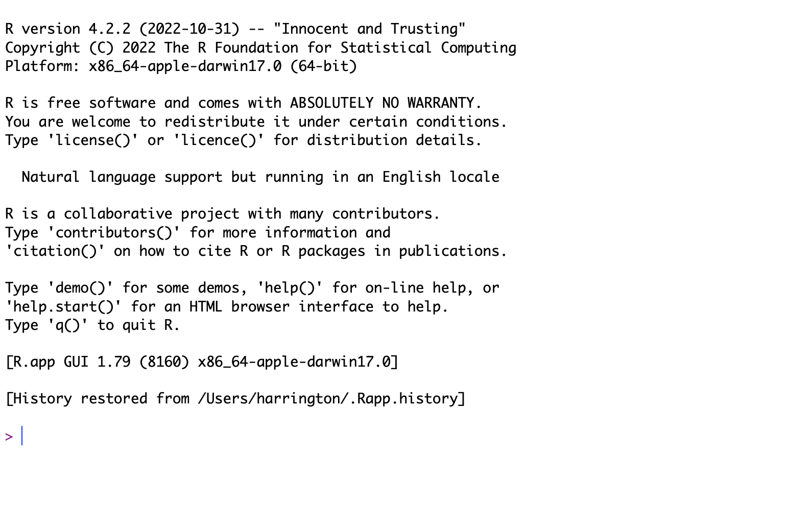

```{r setup, include=FALSE}
knitr::opts_chunk$set(echo = TRUE)
```

## What is R?

R is a programming language for data analysis and visualization. R is open source, meaning that the code that underlies it is open to the public and can be modified by anyone. It is also free.

You can read more about R in the developers' own words [here](https://www.r-project.org/about.html).

In its most basic implementation, R is a command line program and looks like this:

{#id .class width=45% height=45%}\

This means that you only type commands into R, there is no point and click functionality. However, we will be using RStudio, which is an integrated development environment (IDE) which is a much more friendly way to interface with R and does include some limited ability to point and click. 

Coding can be tricky to learn at first. Things like specifying how to make a plot by typing out lines of code can seem cumbersome and slower than clicking some buttons in Excel, but there are major advantages to coding a task, even if you could accomplish it using some other interface that you can interactively click your way through. One of the biggest advantages is that you can save all of your code in a script which then means that you have a full record of exactly how you manipulated your data; this is handy both when you need to write up your methods for publication and for if you need to re-analyze your data or a similar dataset. Once you get the hang of it, you'll also find that R can make graphics that are much better and more customizable than what typical point and click programs are capable of.


## Getting oriented in RStudio

As stated above, we'll be using RStudio. When you open RStudio for the first time, you should see something that looks roughly, but not exactly, like this:


{#id .class width=45% height=45%}\


Note that I've changed the color of my interface and I think I change the order of the two panes on the right. This is just personal preference and has no functional implications.

The pane on the left is the R console that actually runs R code. We can type code straight into the console on the line with the `>` and hit `enter` to run a line. Let's try that quick, type the following into the console and run it:

```{r}
3+3
```

Note that here and throughout these tutorials, blocks of code will appear in gray boxes, with output from R immediately following it (in most cases) in a white box with `##` at the left side of each line of output.


