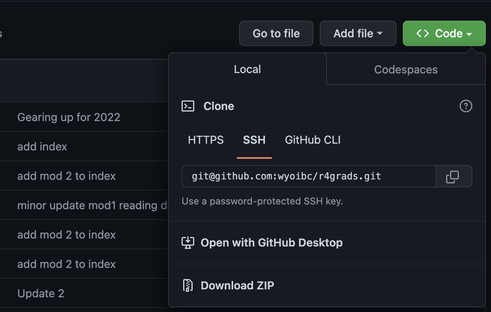

```{r setup, include=FALSE}
knitr::opts_chunk$set(echo = TRUE)
knitr::opts_knit$set(root.dir = "~/r4grads/Fish_data/Modified/")
```

<br>

[Home](https://wyoibc.github.io/r4grads/)

<br>
<br>

In this tutorial, we will explore some basic data manipulation and visualization in R. Occassionally, datasets start out perfectly formatted with no missing data, outliers, etc., More often, you'll need to do some kind of filtering, subsetting, and/or merging of data files. Plotting your data is helpful not only for publication and presentation, but also for identifying potential issues in your data.

<br>

I **highly** recommend writing all of your code in an R script and commenting it liberally. Even for relatively simple operations, if you need to repeat them or slightly tweak them, it's much easier to simply open up your script and re-run it or edit it than to re-type everything into R. Even more importantly, it ensures that there is a record of exactly what you did. If you haven't already dealt with trying to remember how you handled data when you come back it to after a couple weeks or even just a few days, you'll probably be surprised by just how quickly you can forget what you were doing and why.

How to open a script is detailed in the intro to R tutorial.

<br>

* When there are large spaces in this tutorial, this indicates places where you should try to figure out how to code something. If you keep scrolling down, you'll find the solution, but you'll get a lot more out of it if you make a solid attempt to solve the problems yourself first.

<br>
<br>

### Reading in the data

<br>

Before we can work with the data, we need to download it. Go to the Github repository for this workshop: [https://github.com/wyoibc/r4grads](https://github.com/wyoibc/r4grads) and click on the green `Code` button, then on the `Download ZIP` button. (You can alternately clone the repo if you're familiar with git). You can also download the individual files from [here](https://github.com/wyoibc/r4grads/tree/master/Fish_data/Modified) if you know how to do that.

{#id .class width=50% height=50%}\

<br>

Start by setting our working directory. If you set things up exactly as I did, then this path will work for you. If not, then you'll need to edit this path:

```{r, eval = FALSE}
setwd("~/r4grads-master/Fish_data/Modified/")
```

**Again, make sure this points to the correct path for you, not my path.**

<br>

Then read in the data. Here, we have the data in two separate csv files for different data pertaining to some fish. One file is body size data with some information about sampling and the species, and the other file contains stable isotope data.

```{r}
body <- read.csv("Fish_body_size.csv")
iso <- read.csv("Fish_isotopes.csv")
```

* If you get an error here, your working directory is probably not set correctly.

<br>


Let's take a quick look at the top few rows of each dataset.


```{r}
head(body) # Check the top or head of a dataset
head(iso) # if you're not familiar, anything after '#' is a comment and not interpreted by R, it's there just as your own notes on what you're doing. Use them.
```
<br>
We can also look at the bottom few rows.
```{r}
tail(body)
```
<br>
See how many rows and columns are in each dataframe:

```{r}
dim(body) # get the dimensions of 'body' dataset
dim(iso) # get the dimensions of the 'iso' dataset
```

<br>
<br>
Let's take a look at what species are included and how many samples we have of each species.

```{r}
unique(body$Species)

summary(as.factor(body$Species))
```


**What is summary telling us? Do you notice any potential problems with the data from running the previous two commands?**

<br>
<br>
<br>
<br>
<br>
<br>
<br>
<br>
<br>
<br>
<br>
<br>
<br>
<br>
<br>
<br>


### Fixing spelling

Looking at either of those last outputs, you should notice that we have some misspellings. In some cases, "Coho" was written in all capital letters, and because R is case sensitive (as are most other coding languages), these are interpreted as different species. We also have "Dolly Varden" abbreviated down to just "Dolly" in one case, and a misspelling of "Steelhead" as "Steelhesd". We will want to correct these before we move forward with any further data processing.

<br>

There are a few ways to do this. One is by using an indexing approach to identify all of the elements of the objects that contain the values we want to replace, and replacing them with the values we want.

<br>

Let's build this out:

<br>

We'll start by identifying which elements of the "Species" column of `body` contains `"COHO"`

```{r, results = FALSE}
body$Species=="COHO"
```
<br>

You should see a long list of TRUE/FALSE values corresponding to whether each element is (TRUE) or is not (FALSE) "COHO". We can then use this to select out only the TRUE elements of `body$Species`:

```{r, results = FALSE}
body$Species[body$Species=="COHO"]
```

<br>
<br>

And finally, using that indexing to identify the incorrect entries, we can replace them with "Coho":
```{r}
body$Species[body$Species=="COHO"] <- "Coho" # replace all instances of COHO with Coho
```

<br>
<br>
<br>

But there are also much faster ways to do this. The function `gsub()` performs pattern matching and replacement. One of the most essential skills in R is learning how to use new functions. If you already know what function you want to use, you can `?` before a function to get the built-in help documentation. Try it out: 

```{r}
?gsub()
```

<br>

* Note that if you are trying to get help for a function that is not in base R, but contained in a specific package, you'll need to have that package loaded to use `?`. You can use `??` to search in all installed packages, even those not currently loaded.

<br>

As is the case for many functions, `gsub()` has several options that are set to defaults that we won't worry about, we only really care about the first few options here most of the time. 
<br>
<br>

**From looking at this help menu, how would we would replace occurrences of "Steelhesd" with "Steelhead" in `body$Species`?**


<br>
<br>
<br>
<br>
<br>
<br>
<br>
<br>
<br>
<br>
<br>
<br>
<br>
<br>
<br>
<br>
<br>
<br>
<br>
<br>
<br>
<br>
<br>
<br>


```{r}
body$Species <- gsub("Steelhesd", "Steelhead", body$Species)
```

What if we want to replace "Dolly" with "Dolly varden"? Try it out.

<br>
<br>
<br>
<br>
<br>
<br>
<br>
<br>
<br>
<br>
<br>
<br>
<br>
<br>
<br>


I'm guessing that you used something like:

```{r}
body$Species <- gsub("Dolly", "Dolly varden", body$Species)
```

Take another look at the data and let's see if we've cleaned up the species names

```{r}
unique(body$Species)
summary(as.factor(body$Species))
```

<br>

**Do you notice any problems?**

<br>
<br>
<br>
<br>
<br>
<br>
<br>
<br>
<br>
<br>
<br>
<br>
<br>
<br>


What you should notice is that we replaced ALL instances of "Dolly" with "Dolly varden", so what was previously "Dolly varden" is now "Dolly varden varden". What we should have done was the following:

```{r}
body$Species <- gsub("^Dolly$", "Dolly varden", body$Species)
```

<br>

In the above, the `^` indicates the start of a string and the `$` indicates the end of string of a string, indicating that only want to replace Dolly when the D is the start of a string and the y is the end. We could go back to the start, read the data back in from scratch and run the above line, but let's fix "Dolly varden varden" in the existing object now.
<br>
<br>

**Try out turning "Dolly varden varden" back into "Dolly varden**


<br>
<br>
<br>
<br>
<br>
<br>
<br>
<br>
<br>
<br>
<br>
<br>
<br>
<br>
<br>
<br>
<br>
<br>
<br>
<br>


There are a few options for doing this:
```{r}
body$Species <- gsub("^Dolly varden varden$", "Dolly varden", body$Species)
# OR
body$Species <- gsub("varden varden", "varden", body$Species)
# OR
body$Species[body$Species=="Dolly varden varden"] <- "Dolly varden"
```


If we take a look at the data again, we should see that these errors have been corrected:

```{r}
unique(body$Species)
summary(as.factor(body$Species))
```

<br>

We should also know how many species we sampled, and we can check how many are in this dataset:

```{r}
length(unique(body$Species))
```

<br>


Things look pretty good now. Note that misspellings like these are relatively easy to catch, but incorrect numerical values can be much harder. Those errors will typically require plotting of the data to identify obviously incorrect values, which we'll cover later. 

<br>
<br>

### Merging the data

Before we continue on, we'd like to have all of our data in a single object. This is simpler to keep track of and also allows us to apply filters and manipulations to the entire dataset at once, rather than needing to modify each object individually.

When merging, datasets may not include the same exact samples or samples may be in different orders, so we can't just stick the columns all together.  

**Take another look at the dimensions of our two data objects like we did at the start.**  

You'll notice that they have different numbers of rows, indicating that at least one sample is in one set but not the other.

<br>

We can check for `Fish.code` elements that are in the body size data but not the isotope data:

```{r}
which(!body$Fish.code %in% iso$Fish.code)
```

the `%in%` operator checks for occurrences of the preceding object in the following object, and returns a vector of TRUE/FALSE. The `!` at the beginning reverses TRUE/FALSE, so that TRUE instead corresponds to elements of `body$Fish.code` that are NOT in `iso$Fish.code`, and the `which()` gives us the numeric indices of the elements of the TRUE/FALSE vector that are true. The result is that the numbers this spits out are the indices of `body$Fish.code` that are NOT in `iso$Fish.code`.

We can use this as an index to get the actual values of `body$Fish.code` that are not shared by `iso$Fish.code`:

```{r}
body$Fish.code[which(!body$Fish.code %in% iso$Fish.code)]
```

and we can run the same check in reverse order to see values of `iso$Fish.code` not in `body$Fish.code`:

```{r}
iso$Fish.code[which(!iso$Fish.code %in% body$Fish.code)]
```


<br>

We can see that we have a total of 9 samples that are present in one of the datasets, but not the other. We could use some fancy R indexing and the `match()` function to subset both of the datasets down to only these shared samples in the same row order, but this is somewhat tedious to do.


Instead, there is an R function we can use that will do all of that for us: `merge()`:

```{r}
all_data <- merge(body, iso)
head(all_data)
dim(all_data)
```


Knowing how R objects are structured and how to extract specific elements from objects using brackets and `$` is useful, but there are functions that will simplify most common data manipulations, and we'll explore these shortly.

<br>

Before we move on, let's write our merged `all_data` object to a csv file:

```{r}
write.csv(all_data, "fish_data_merged.csv")
```


Then we can easily read this cleaned and merged data into R or another program anytime we want without having to repeat these steps. `.csv` or "comma-separated values" is a very common file format for data. It is easily computer-readable because it contains no formatting, only values, with columns separated by commas. 


Also note that by writing a new file from R, we can read in the raw data, edit/filter it as we like, and then write the output to a new file with no risk of accidentally overwriting or editing the raw data. If all of your R commands are saved in a script, then you will end up with your untouched raw data, the manipulated data, and a full record of the manipulations.

<br>

Read that .csv file back into R just to demonstrate that we have successfully written out the data.


```{r}
all_data <- read.csv("fish_data_merged.csv")
```

<br>
<br>

# Plotting with ggplot2

<br>

One of the best things about R is its ability to make pretty much any type of plot you'd like. This is useful for exploring your data and also for making high-quality figures that you can put into your publications. I have made nearly all of the figures in my published papers in R.

You can do a lot of plotting with R's base functions, e.g., using the `plot()`
function, but you get much better control and flexibility using the `ggplot2` package. If you get familiar with the general style of `ggplot`, you'll pretty quickly start to notice that many figures in research papers are made with this package.

<br>

`ggplot2` is part of the Tidyverse set of packages, so we can install and then load it using:

```{r eval = FALSE}
install.packages("tidyverse")
```
```{r}
library(tidyverse)
```

<br>

Before we actually get started, there's an important issue to point out in this loading message. The conflicts show that there are functions in `dplyr` and the base R `stats` packages that share the same function names. Whenever this happens, the function from the most recently loaded package will mask the other function. If you load `dplyr` last and then run `filter()`, what you'll get is the function from `dplyr`. Alternately, if you load `stats` last, you'll get the `filter()` function from that package.

This is important to keep track of. Especially if you write a script and then edit it to load up a package at the the top of a script. You can always call a function from a specific package by using the notation `package::function()`. The double colons tell R to explicitly use a function from the stated package.

<br>


You can also specifically install and/or load ggplot2 by itself using the following if you uncomment it. I've commented it here because if you try to install `ggplot2` on its own right now, it will restart R and we'll need to re-run everything we've done so far.

```{r eval = FALSE}
# install.packages("ggplot2")
# library(ggplot2)
```


<br>
<br>


### ggplot syntax

`ggplot` makes some very nice figures, but it has a unique syntax that can take a little while to learn. We'll make a quick plot, then explain what's going on here:

```{r}
ggplot(data = all_data) + 
  geom_point(mapping = aes(x = Fork.length..cm., y = Weight..g.))
```

<br>

All calls to `ggplot()` are composed of at least two pieces. The first simply specifies the object that contains the data. All of the data for the plot should be in a single object, with different variables in different columns and each row specifying a single observation of a data (this is part of the general "Tidy" data philosophy).

The basic `ggplot()` call without adding in a `geom` function will just render a blank plot, since you haven't told it what kind of plot to make with the data - this is unlike the base R `plot()` function we used above, which will try to guess what type of plot you want based on the nature of the data.

```{r, fig.show = 'hide'}
ggplot(data = all_data) # this makes an empty plot
```

<br>

In the full call:

```{r, fig.show = 'hide'}
ggplot(data = all_data) + 
  geom_point(mapping = aes(x = Fork.length..cm., y = Weight..g.))
```

The `geom_point()` function tells `ggplot` to plot out the data as points. Within this function, the `mapping` argument specifies how the data are mapped to the visualization. The mapping is specified using the `aes()` (aesthetic) function. Here we specify only which variable is x and which is y, but there are other things we can specify as well.

* Multiple `geom` functions can be combined into a single plot, and the `mapping` argument can be specified independently in each, or can be specified globally within the `ggplot()` function call.


<br>

### Aesthetic mappings 

We've so far plotted out two variables, but we can add information about additional variables by passing additional arguments to `aes()`. For example, we can change the shape the points by species:

```{r}
ggplot(data = all_data) + 
  geom_point(mapping = aes(x = Fork.length..cm., y = Weight..g., shape = Species))
```

* Note the warning that we can only assign up to 6 shapes to variables, and see that three spine stickleback has been left out because of this. 

<br>

Instead we can change the color by species:

```{r}
ggplot(data = all_data) + 
  geom_point(mapping = aes(x = Fork.length..cm., y = Weight..g., color = Species))
```

<br>

We can also scale the size of the points by some variable using the `size` argument in `aes()`. Try modifying the above plot so that the points are sized by `del15N`.

<br>
<br>
<br>
<br>
<br>
<br>
<br>
<br>
<br>
<br>
<br>
<br>
<br>
<br>
<br>
<br>
<br>
<br>
<br>
<br>
<br>
<br>
<br>
<br>
<br>
<br>
<br>
<br>
<br>
<br>
<br>
<br>


```{r}
ggplot(data = all_data) + 
  geom_point(mapping = aes(
    x = Fork.length..cm., 
    y = Weight..g., 
    color = Species,
    size = del15N))
```

This is a very busy plot at this point, and for me, all points are too large to be interpretable, so let's add a function that controls the range of point sizes:

```{r}
ggplot(data = all_data) + 
  geom_point(mapping = aes(
    x = Fork.length..cm., 
    y = Weight..g., 
    color = Species,
    size = del15N)) +
  scale_size(range = c(0.1, 2))
```

This is a little better, but still is clearly not the best way to display these data. Just because you *can* plot things in a certain way, doesn't mean you *should* plot them that way.


<br>

If we want to change the color (or size, shape, etc.) of all points, rather than according to a variable, we can do this by pulling that aesthetic outside of the `aes()` function and setting it manually:

```{r}
ggplot(data = all_data) + 
  geom_point(mapping = aes(x = Fork.length..cm., y = Weight..g.), color = "blue")
```


<br>
<br>
<br>
<br>
<br>

[Home](https://wyoibc.github.io/r4grads/)

<br>
<br>


