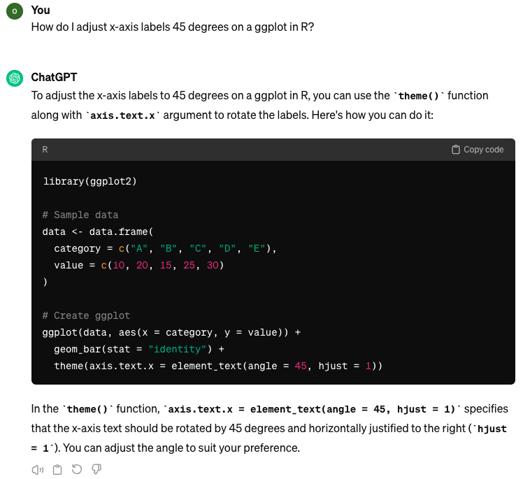
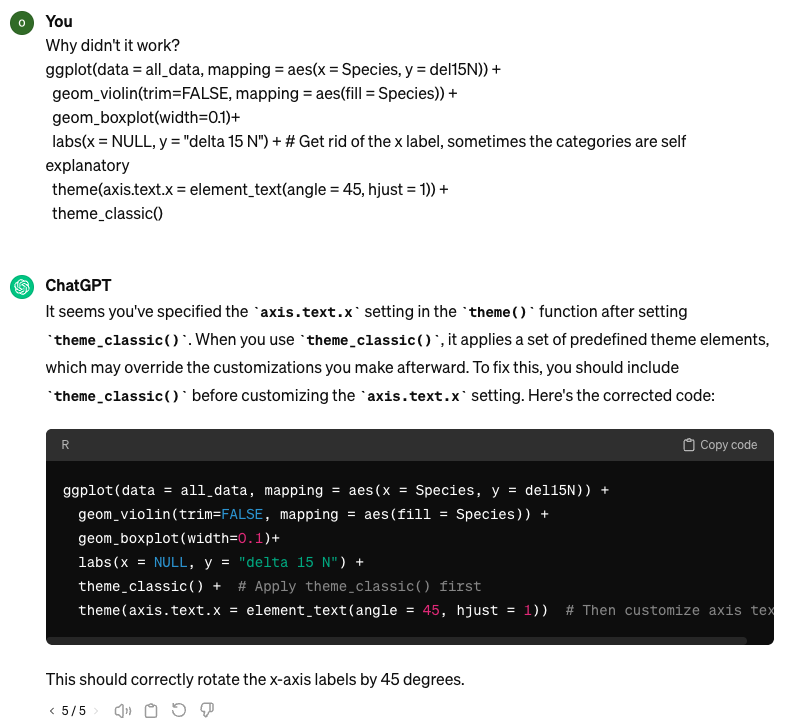
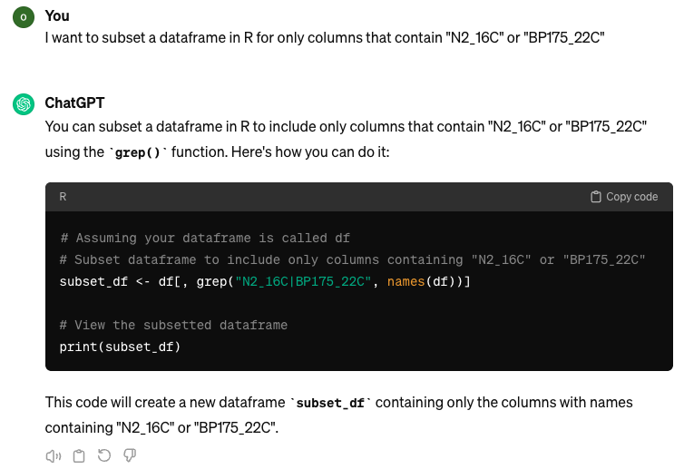

```{r setup, include=FALSE}
knitr::opts_chunk$set(echo = TRUE)
knitr::opts_knit$set(root.dir = "~/Documents/r4grads/")

```

<br>

[Home](https://wyoibc.github.io/r4grads/)

<br>
<br>

## Using chatGPT to help with coding:

[chatGPT](https://chat.openai.com/)
<br>
[Google Gemini](https://gemini.google.com/app)

Large Language Model chatbots like chatGPT and google Gemini are increasingly avalible and sophisticated. They can do any number of tasks, inlcuding help with coding projects and data analysis. Lets explore a couple ways these tools can be helpful for adding feature to our plots from last week.
<br>
First let's reload the fish data. Make sure you set your working directory with setwd() like we did before. Also lets library tidyverse so we have all those functions as well. 

```{r, eval = FALSE}
# Make sure you set this to your personal working directory with the fish data!
setwd("~/Downloads/r4grads-master/Fish_data/Modified/")
```

Now lets reload our tidyverse functions with library() and load the fish data we were using last week.

```{r}
library(tidyverse)
all_data <- read.csv("fish_data_merged.csv")
```
Here's our violin plots from last week

```{r}
ggplot(data = all_data, mapping = aes(x = Species, y = del15N)) + 
  geom_violin(trim=FALSE, mapping = aes(fill = Species)) +
  geom_boxplot(width=0.1)+
  labs(x = NULL, y = "delta 15 N") + # Get rid of the x label, sometimes the categories are self explanatory
  theme_classic()
```
<br>
<br>
These look great, but what if we want to turn the x-axis titles 45 degrees to make them a bit easier to read? If you're not immediately sure how to do this, you could google it, but AI chat-bots might also be helpful.

<br>
Open up [chatGPT](https://chat.openai.com/) and login. For most of these chatbots, you'll need a free account to access them. You can make a new account, or link your Google, Microsoft or Apple account to the service and log in that way. If you already have a Gmail and google account you can use [Google Gemini](https://gemini.google.com/app) which should give you the same results. The process is fairly easy, but if you don't want to deal with making an account feel free to just follow along for this part.

Once we're into the chatbot, lets ask it our question: "How do I adjust x-axis labels 45 degrees on a ggplot in R?"
<br>
<br>

<br>
<br>
Cool! Looks like one way to do this is by adding to theme(), a function we've used before in ggplot. chatGPT and Gemini typically can identify that you're  askign it questions about coding, and will give you code answers. We don't need the entire script in this case, just the last line:

```{r, eval = FALSE}
theme(axis.text.x = element_text(angle = 45, hjust = 1))
```

and if we copy-paste that into our violin plot function, it should look something like:

```{r}
ggplot(data = all_data, mapping = aes(x = Species, y = del15N)) + 
  geom_violin(trim=FALSE, mapping = aes(fill = Species)) +
  geom_boxplot(width=0.1)+
  labs(x = NULL, y = "delta 15 N") + # Get rid of the x label, sometimes the categories are self explanatory
  theme(axis.text.x = element_text(angle = 45, hjust = 1)) +
  theme_classic()

```
<br>
<br>
That's weird, it didn't seem to tilt our x-axis labels. Can you see what I did wrong?
<br>
<br>
<br>
<br>
<br>
<br>
<br>
<br>
<br>
<br>
<br>
<br>
<br>
<br>
<br>
<br>
<br>
<br>
<br>
<br>
<br>
<br>
<br>
<br>
<br>
<br>
<br>
<br>
<br>
<br>
<br>
<br>
<br>
<br>
<br>
<br>
Maybe you remember from last week the order matters! But if you didn't notice my mistake, or if you encounter other probelms in your coding adventures, you can also ask these chat bots for help. In this instance, I'm going to give it my entire block of code and simply ask, "Why doesn't this work?" It can be useful to use Shift+Enter here to put multiple lines of text in the prompt box befor submitting your request.
<br>
<br>

<br>
<br>
Of course, we're trying to use theme twice, and the theme_classic is overwriting the x labels. Now we could look at this and manually edit it, or we can just hit the "Copy code" button and paste that into our R script, now that we've given the chatbot specific about the code we're trying to write.
<br>
```{r}
ggplot(data = all_data, mapping = aes(x = Species, y = del15N)) + 
  geom_violin(trim=FALSE, mapping = aes(fill = Species)) +
  geom_boxplot(width=0.1)+
  labs(x = NULL, y = "delta 15 N") +
  theme_classic() +  # Apply theme_classic() first
  theme(axis.text.x = element_text(angle = 45, hjust = 1))  # Then customize axis text
```
<br>
Much better! As you could probably already guess, these chatbots can only get you so far, and you still need to think for yourself and do some troubleshooting. They're still very useful tools though, and can help teach you about new ways to do things in R, or give you hints as to why your code isn't working properly. Lets take a look at another example.
<br>
<br>

## Planning out your coding projects

<br>
<br>
You now know some of the very basics of R and all the many wonderful things you can do with it. When starting a project from scratch however, it can be a bit daunting on where to begin, so lets think about some solid practices for planning out your very own data analysis.
<br>
When starting a new project I like to say out loud to myself, or just write down in simple terms what exactly it is I'm trying to accomplish. This may sound a little silly but can save you lots of time in the end. Let's look at an example of manipulating some RNAseq data. 
<br>
```{r, eval = FALSE}
# Load my data and metadata into R

# Inspect my data to make sure it looks OK

# Filter for genotype and temperature

# Run DEseq2

# Plot a Volcano Plot of the results
```
Let's start with the first step, loading my data into R. I already put this data on my GitHub, so I'll download it from there. Feel free to grab my data as well and follow along if you wish.
<br>
```{r}
# Load my data into R
meta_data <- read.csv("https://raw.githubusercontent.com/ohfunk/L1_bulk_22/main/L1_bulk_22_metadata.csv")
gene_counts <- read.csv("https://raw.githubusercontent.com/ohfunk/L1_bulk_22/main/L1_bulk_22_gene_counts_matrix.tsv", sep = "\t", row.names = "Gene")

# Inspect my data to make sure it looks OK
head(meta_data)

# Filter for genotype and temperature

# Run DEseq2

# Plot a Volcano Plot of the results
```

This looks pretty good, now lets look at the gene_counts:
<br>
```{r}
# Inspect my data to make sure it looks OK
head(gene_counts)

# Filter for genotype and temperature

# Run DEseq2

# Plot a Volcano Plot of the results
```
<br>
Looks pretty good! However there's a lot of different samples here. Lets ask chatGPT for help filtering out only the samples with genotype: N2 or BP175 and temperature: 16C
<br>

<br>
This time chatGPT suggests using the grep function. This is a command line tool from Unix but we can use it in R as well. Lets try grep on our gene_counts object.
<br>
```{r}
# Filter for genotype and temperature
gene_counts_cleaned <- gene_counts[, grep("N2_16C|BP175_16C", names(gene_counts))]
colnames(gene_counts_cleaned)
# Run DESeq2


# Plot a Volcano Plot of the results
```
Great, looks like we have just 6 samples now, 3 of N2 and 3 of WH171. Lets do this for out meta_data too. We could try and use this grep function again (feel free to try and make it work for rows in meta_data) but we can also go back to the filter() function we learned before.
<br>
```{r}
# Filter for genotype and temperature
meta_data_cleaned <- filter(meta_data, geno == 'N2' & temp == '16C' | geno =='BP175' & temp =='16C')
meta_data_cleaned
# Run DESeq2


# Plot a Volcano Plot of the results
```
<br>
Now it's time to run our differential expression. This is a BIG oversimplification of some complex biostatistics. If you were doing this on your own you would want to read up on the [DESeq2](https://www.bioconductor.org/packages/release/bioc/vignettes/DESeq2/inst/doc/DESeq2.html) package and understand the nuances of what you were applying to the data.
<br>
However, using chatbots can give you a great start on getting there, so lets see if chatGPT can help us with running DESeq2. Our prompt would probably be something like:
<br>
* **In R, I have a meta data file called meta_data_cleaned and a counts matrix called gene_counts_cleaned. I want to run differential expression on this using DESeq2**
<br>
Your results may vary, but I got the below back from chatGPT:
<br>
```{r, eval = FALSE}
# Install and load required packages
install.packages("DESeq2")
install.packages("tidyverse")
library(DESeq2)
library(tidyverse)

# Load metadata
meta_data <- read.csv("path/to/meta_data.csv")  # Replace "path/to/meta_data.csv" with your file path

# Load counts matrix
gene_counts_cleaned <- read.csv("path/to/gene_counts_cleaned.csv", row.names = 1)  # Replace "path/to/gene_counts_cleaned.csv" with your file path

# Check dimensions and structure of your data
dim(meta_data)
dim(gene_counts_cleaned)
head(meta_data)
head(gene_counts_cleaned)

# Create DESeq2 object
dds <- DESeqDataSetFromMatrix(countData = gene_counts_cleaned,
                              colData = meta_data_cleaned,
                              design = ~ your_formula_here)

# Replace "your_formula_here" with the formula representing your experimental design.
# For example, if your design has a single factor "condition", the formula would be:
# design = ~ condition

# Run DESeq2 analysis
dds <- DESeq(dds)

# Get differential expression results
res <- results(dds)

# Extract significant results
sig_results <- res[which(res$padj < 0.05), ]

# Check top DE genes
topGenes <- head(sig_results[order(sig_results$padj), ], n = 10)

# Explore or visualize the results further as needed

```
<br>
A pretty good start! Clearly we don't need to reload the packages with library, and we already have meta_data and gene_counts_cleaned as variables we've created, but you can see how chatGPT is trying to give us it's best guess as to what we're doing, and even uses head() and dim() to QC our data much like we planned before. If I strip out the unnecessary pieces it should looks something like:
<br>
```{r,eval=FALSE}
library(DESeq2)
# Create DESeq2 object
dds <- DESeqDataSetFromMatrix(countData = gene_counts_cleaned,
                              colData = meta_data_cleaned,
                              design = ~ your_formula_here)

# Replace "your_formula_here" with the formula representing your experimental design.
# For example, if your design has a single factor "condition", the formula would be:
# design = ~ condition

# Run DESeq2 analysis
dds <- DESeq(dds)

# Get differential expression results
res <- results(dds)

# Extract significant results
sig_results <- res[which(res$padj < 0.05), ]

# Check top DE genes
topGenes <- head(sig_results[order(sig_results$padj), ], n = 10)
```
<br>
If you read some of the commented code, you can see that it has a dummy variable "your_formula_here" that we'll need to replace. Because we didn't specify what the condition was we were looking at, we can remind our selves of what the meta_data table looks like with View(meta_data) and choose the appropriate column, in this case "geno" and substitute it in for your_formula_here
<br>
```{r}
suppressMessages(library(DESeq2))

# Create DESeq2 object
dds <- DESeqDataSetFromMatrix(countData = gene_counts_cleaned,
                              colData = meta_data_cleaned,
                              design = ~ geno)


# Run DESeq2 analysis
dds <- DESeq(dds)

# Get differential expression results
res <- results(dds)

# Extract significant results
sig_results <- res[which(res$padj < 0.05), ]

# Check top DE genes
topGenes <- head(sig_results[order(sig_results$padj), ], n = 10)
```
<br>
Now that DESeq is finished running, lets take a look at our topGenes object that it created:
<br>
```{r}
topGenes
```
<br>
The next thing we set out to do was make a volcano plot with this data. This is a very common plot for differential transcriptomics, and you could probably figure it out on your own with ggplot, but lets see what chatGPT can do. The prompt might be:
<br>
* **Make a volcano plot from the output of DESeq2 in R with ggplot**
<br>
Which might give you an answer similar to:
<br>
```{r}
# Create a dataframe with log2 fold changes and adjusted p-values
volcano_data <- as.data.frame(results(dds)[, c("log2FoldChange", "padj")])

# Plot volcano plot
ggplot(volcano_data, aes(x = log2FoldChange, y = -log10(padj))) +
  geom_point(size = 1) +
  geom_hline(yintercept = -log10(0.05), linetype = "dashed", color = "red") +  # Add significance threshold
  labs(x = "log2 Fold Change", y = "-log10(Adjusted p-value)", title = "Volcano Plot")
```
<br>
This looks pretty good, but we can do better! Lets ask chatGPT to add some text labels for out top hits and change some point colors.
<br>
```{r}
library(ggrepel)
volcano_data <- as.data.frame(results(dds)[, c("log2FoldChange", "padj")])
volcano_data$gene <- rownames(volcano_data)  # Add gene names as a new column


# Plot volcano plot with customized axes and colors
ggplot(volcano_data, aes(x = log2FoldChange, y = -log10(padj), color = ifelse(log2FoldChange > 0 & padj < 0.05, "red", ifelse(padj < 0.05, "blue", "gray")))) +
  geom_point(size = 1) +  # Plot points
  geom_hline(yintercept = -log10(0.005), linetype = "dashed", color = "black") +  # Add significance threshold
  geom_text_repel(data = head(volcano_data[order((volcano_data$padj)),], 5),  # Top 5 differentially expressed genes
                  aes(label = gene), 
                  size = 3, 
                  vjust = 0.1,
                  hjust = 1) +  # Add gene labels
  labs(x = "log2 Fold Change", y = "-log10(Adjusted p-value)", title = "Volcano Plot") +
  theme_classic() +
  scale_color_manual(values = c("red", "darkgray", "blue")) +  # Set color palette
  guides(color = FALSE)  # Remove legend
```
<br>
<br>
<br>

## Data exploration on your own
To finish, I want to to try and design and write some very simple projects yourself. You can use the fish data from before, you can use my RNAseq data, or you can use the example datasets provided by dplyr. dplyr is loaded when we load tidyverse, and comes with a couple of small dataframes. One of these is called "starwars" lets take a look at this dataframe:
<br>
```{r}
starwars
```
<br>
Another data set is called storms: 
<br>
```{r}
storms
```
<br>
What kinds of questions can we ask with these data sets? The possibilities are endless, but try and think of some easy questions on your own, plan out how you might graph them, and then try and use the skills you've learned with chatGPT to fill in the blanks to make a quick graph.
<br>
<br>
<br>
<br>
<br>
<br>
<br>
<br>
<br>
<br>
<br>
<br>
<br>
<br>
<br>
<br>
<br>
<br>
<br>
<br>
<br>
<br>
<br>
<br>
<br>
<br>
<br>
<br>
<br>
<br>
<br>
<br>
I've chosen to look at the storms dataset, and ask "are severe storms getting more frequent?" To do this, I'll first map out what I want to do in comment blocks:
<br>
```{r}
# Look at my data set
head(storms)

# Subset this data for only storms of Category 4 or greater
big_storms <- filter(storms, category >= 4)

# Count how many big storms there were per year
storms_per_year <- dplyr::count(big_storms, year)

# Plot this data with year as the x axis and number of storms on the y axis
ggplot(storms_per_year, aes(x = year, y = n)) +
  geom_line(color = "blue") +  
  labs(title = "Number of Storms (Category 4+) by Year",
       x = "Year",
       y = "Number of Storms") +
       theme_classic()

# Add a trend line
ggplot(storms_per_year, aes(x = year, y = n)) +
  geom_line(color = "blue") +  
  labs(title = "Number of Storms (Category 4+) by Year",
       x = "Year",
       y = "Number of Storms") +
       theme_classic() +
  geom_smooth(method = "lm", se = FALSE)
```
<br>
<br>
<br>

[Home](https://wyoibc.github.io/r4grads/)