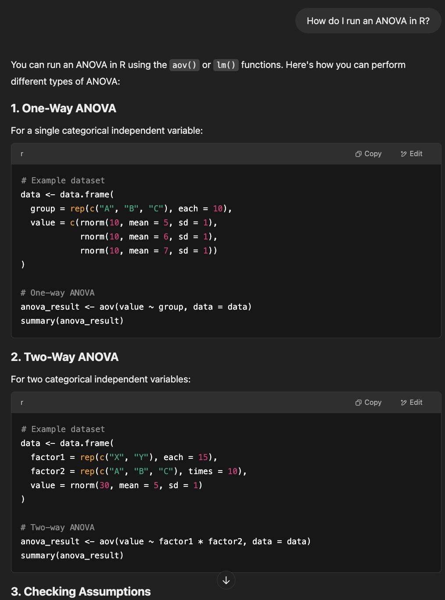
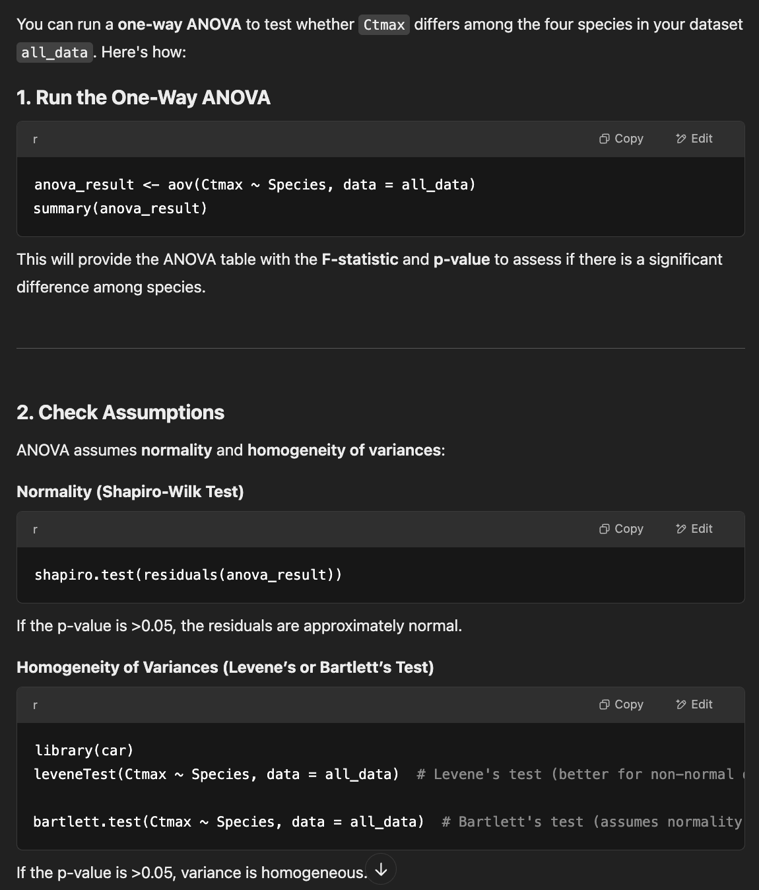
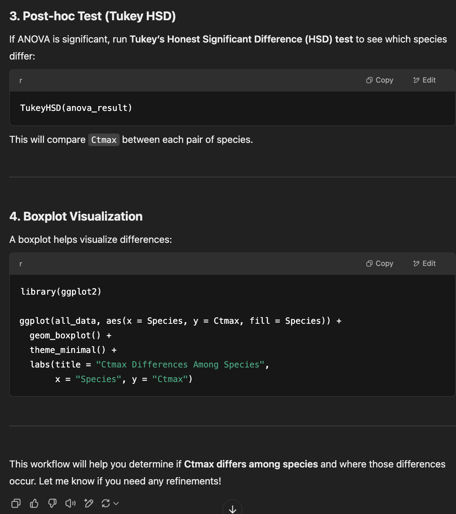
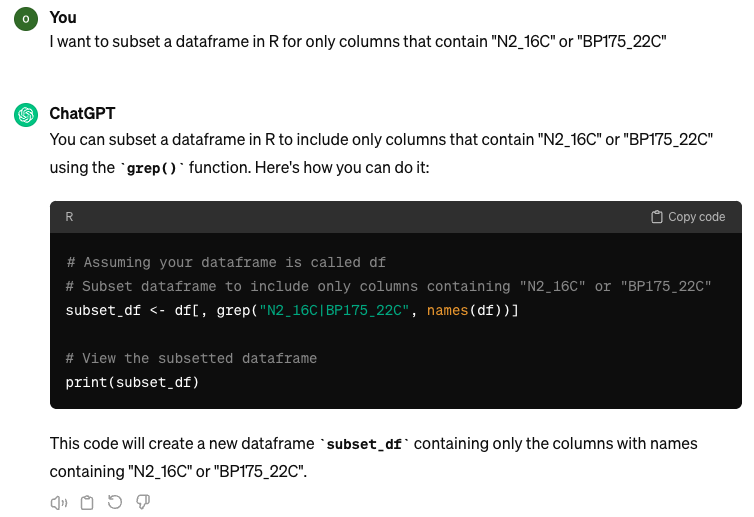

```{r setup, include=FALSE}
knitr::opts_chunk$set(echo = TRUE)
knitr::opts_knit$set(root.dir = "~/r4grads/lizard_data/")
```

<br>

[Home](https://wyoibc.github.io/r4grads/)

<br>
<br>

## Using chatGPT to help with coding:

[chatGPT](https://chat.openai.com/)

<br>

[Google Gemini](https://gemini.google.com/app)

Large Language Model chatbots like chatGPT and Google Gemini are increasingly available and sophisticated. They can do any number of tasks, including help with coding projects and data analysis. Let's explore a couple ways these tools can be helpful in data analysis, using the data from the last few weeks.

<br>

First let's reload the lizard data. Make sure you set your working directory like we did before.

```{r, eval = FALSE}
# Make sure this is set to the correct directory on your computer
setwd("~/r4grads/lizard_data/")
```

We'll need our `all_data` object again. If you have your `"lizard_data_merged.csv"` file that we wrote out last time, you can read in:

```{r}
all_data <- read.csv("lizard_data_merged.csv")
```

<br>
<br>

If you've lost track of this file, we can create it again:

* **If you have the "lizard_data_merged.csv" file and were able to run the line above, you do not need to run these lines!**

```{r}
# read in each of the data files
sample_data <- read.csv("lizard_data.csv")
physio_data <- read.csv("physio_data.csv")
# Make all of the substitutions that we made last time
sample_data$Species <- gsub("S. Occidentalis", "S. occidentalis", sample_data$Species)
sample_data$Species <- gsub("S. occidentlis", "S. occidentalis", sample_data$Species)
sample_data$Species <- gsub("^graciosus$", "S. graciosus", sample_data$Species)
# Merge the data
all_data <- merge(sample_data, physio_data)
```

<br>

We also need to load up the tidyverse set of packages:

```{r}
library(tidyverse)
```


Here's our violin plots from last week

```{r}
ggplot(data = all_data, mapping = aes(x = Species, y = Ctmax)) + 
  geom_violin(trim=FALSE, mapping = aes(fill = Species)) +
  geom_boxplot(width=0.1)+
  labs(x = NULL, y = "CTmax") + # Get rid of the x label, sometimes the categories are self explanatory
  theme_classic() +
  theme(legend.position="none")
```


<br>
<br>

This shows us that we probably have some significantly different CTmax values among the different species, but to actually claim that in a paper, we need to run a statistical test like an ANOVA. I know that ANOVAs can be run in R, but I don't remember how to run them. Instead of Googling that, let's see if chatGPT can write some code for us.


<br>

Open up [chatGPT](https://chat.openai.com/) and login. For most of these chatbots, you'll need a free account to access them. You can make a new account, or link your Google, Microsoft or Apple account to the service and log in that way. If you already have a Gmail and google account you can use [Google Gemini](https://gemini.google.com/app) which should give you the same results. The process is fairly easy, but if you don't want to deal with making an account feel free to just follow along for this part.

* Side note: with these data, you would need to account for phylogenetic relatedness, since we generally expect more closely related to species to have more similar trait values. We'll ignore that here.

Once we're into the chatbot, lets ask it our question: "How do I run an ANOVA in R?"
<br>
<br>

You should get something like this, with additional explanation that went farther down the page:

{width=80%}

<br>
<br>

Cool! This gives us some dummy code with some groups made of randomly sampled numbers. We could go through and figure out how to apply this to our data, but I'm lazy. Instead, let's give chatGPT more detail about our data and what we want. How would you structure a query to tell chatGPT about the data and that we want to run an ANOVA to determine if CTmax varies by species?


<br>
<br>
<br>
<br>
<br>
<br>
<br>
<br>
<br>
<br>
<br>
<br>
<br>
<br>
<br>
<br>
<br>
<br>
<br>
<br>
<br>
<br>
<br>
<br>
<br>
<br>
<br>
<br>
<br>
<br>
<br>
<br>
<br>
<br>
<br>
<br>


I would ask that question like this:

<br>

```
I have an R object called "all_data" that looks like this:

  Lizard.ID.         Species Elevation..m. svl Ctmax
1       10_o S. occidentalis           904  75 40.50
2       11_o S. occidentalis           904  66 43.72
3       12_j     S. jarrovii          1646  53 42.08


I want to run an ANOVA to determine if "Ctmax" is statistically significantly different among "Species". There are 4 different species: "S. occidentalis" "S. jarrovii"     "S. graciosus"    "S. virgatus" 

How do I do this?
```
<br>


* I ran `head(all_data)` to see what the top of the object looks like
* Note that I use the names of objects and column names explicitly
* The information about the species is probably unnecessary, but it doesn't hurt to include. I got that by running `unique(all_data$Species)`

* **When entering many lines into chatGPT, if can help to hit `shift + enter` to add in blank lines. If you hit just `enter`, you will ask your query.**


I get this:

<br>
<br>
{width=80%}
{width=80%}

<br>
<br>

Let's try that out:


```{r}
anova_result <- aov(Ctmax ~ Species, data = all_data)
summary(anova_result)
```
I'm going to skip the homogeneity of variances tests now, but you should not with your own data. Instead, I'm going to skip straight to the post-hoc test to see which groups are different:

```{r}
TukeyHSD(anova_result)
```

Pretty cool!


<br>


What if we want to add in some annotations on our violin plots to show the significance? How would you ask chatGPT for this?


<br>
<br>
<br>
<br>
<br>
<br>
<br>
<br>
<br>
<br>
<br>
<br>
<br>
<br>
<br>
<br>
<br>
<br>
<br>
<br>
<br>
<br>
<br>
<br>
<br>
<br>
<br>
<br>
<br>
<br>
<br>
<br>
<br>
<br>
<br>
<br>


This is my query:

```
I have this violin plot code:

ggplot(data = all_data, mapping = aes(x = Species, y = Ctmax)) + 
  geom_violin(trim=FALSE, mapping = aes(fill = Species)) +
  geom_boxplot(width=0.1)+
  labs(x = NULL, y = "CTmax") + # Get rid of the x label, sometimes the categories are self explanatory
  theme_classic() +
  theme(legend.position="none")

and ran ANOVA & Tukey tests:

anova_result <- aov(Ctmax ~ Species, data = all_data)
summary(anova_result)
TukeyHSD(anova_result)


In the violin plot, how can I put askerisks or letters above each of the 4 species to indicate which are significantly from each other?
```


The output is long, but the relevant code I get out is this:


```{r, eval = FALSE}
install.packages("ggsignif")
```

```{r}
# Tukey HSD test results
tukey_result <- TukeyHSD(anova_result)

# Extracting the significant comparisons
tukey_df <- as.data.frame(tukey_result$Species)
colnames(tukey_df)[colnames(tukey_df) == "p adj"] <- "p.adj"  # I added this manually
significant_pairs <- tukey_df[tukey_df$p.adj < 0.05, ]

# Plot
library(ggplot2)
library(ggsignif)

ggplot(data = all_data, mapping = aes(x = Species, y = Ctmax)) + 
  geom_violin(trim = FALSE, mapping = aes(fill = Species)) +
  geom_boxplot(width = 0.1) +
  labs(x = NULL, y = "CTmax") +
  theme_classic() +
  theme(legend.position = "none") +
  
  # Adding significance annotations
  geom_signif(comparisons = list(c("S. occidentalis", "S. jarrovii"),
                                 c("S. occidentalis", "S. graciosus"),
                                 c("S. jarrovii", "S. graciosus"),
                                 c("S. virgatus", "S. graciosus")), 
              map_signif_level = TRUE)

```

<br>
<br>

There's an obvious problem here, the lines obove the violin plots are completely overlapping. I'll tell chatgpt:

```
with ggsignif, I get completely overlapping bars above my violins
```


and I get out this modified code:

```{r}
# Tukey HSD test results
tukey_result <- TukeyHSD(anova_result)

# Extracting the significant comparisons
tukey_df <- as.data.frame(tukey_result$Species)
colnames(tukey_df)[colnames(tukey_df) == "p adj"] <- "p.adj"  # I added this manually
significant_pairs <- tukey_df[tukey_df$p.adj < 0.05, ]

# Plot
library(ggplot2)
library(ggsignif)

ggplot(data = all_data, mapping = aes(x = Species, y = Ctmax)) + 
  geom_violin(trim = FALSE, mapping = aes(fill = Species)) +
  geom_boxplot(width = 0.1) +
  labs(x = NULL, y = "CTmax") +
  theme_classic() +
  theme(legend.position = "none") +
  
  # Adding significance annotations
  geom_signif(comparisons = list(c("S. occidentalis", "S. jarrovii"),
                                 c("S. occidentalis", "S. graciosus"),
                                 c("S. jarrovii", "S. graciosus"),
                                 c("S. virgatus", "S. graciosus")), 
              map_signif_level = TRUE, 
              y_position = c(45, 46, 47, 48))  # Manually adjust y_position

```


We can fix those lines, and we also need to fix the ordering of the lines. If you look back at your Tukey test summary, you'll see that we're not showing the correct significance values for the comparisons - S. virgatus-S. jarrovii  should be significant but doesn't show on the plot and S. occidentalis-S. graciosus  should not be significant. **When coding with chatGPT you always need to be careful that you're getting out what you expect.** It is easy to get things that look right at first glance but that misrepresent your data.

<br>
<br>
<br>

I asked a few more queries, and the closest I was able to get was this:


```{r}
# Tukey HSD test results
tukey_result <- TukeyHSD(anova_result)

# Extracting the significant comparisons
tukey_df <- as.data.frame(tukey_result$Species)
colnames(tukey_df)[colnames(tukey_df) == "p adj"] <- "p.adj"  # I added this manually
significant_pairs <- tukey_df[tukey_df$p.adj < 0.05, ]

# Plot
library(ggplot2)
library(ggsignif)

ggplot(data = all_data, mapping = aes(x = Species, y = Ctmax)) + 
  geom_violin(trim = FALSE, mapping = aes(fill = Species)) +
  geom_boxplot(width = 0.1) +
  labs(x = NULL, y = "CTmax") +
  theme_classic() +
  theme(legend.position = "none") +
  
  # Adding significance annotations
  geom_signif(comparisons = list(c("S. jarrovii", "S. graciosus"),
                                 c("S. virgatus", "S. graciosus"),
                                 c("S. occidentalis", "S. jarrovii"),
                                 c("S. virgatus", "S. jarrovii")), 
              map_signif_level = TRUE, 
              y_position = c(45 + 2, 46 + 3, 47 + 4.5, 48 + 5.5))  # Raised by 2 units

```


<br>


**Superficially, this looks good, but it  has the wrong significance symbols above the lines.** This was also the case before, but we couldn't tell that. After an hour or so of chatGPT giving me increasingly wrong answers, I looked at the code more carefully, realized that ggsignif was calculating incorrect (or at least different) significance values internally, and it was not using the values we calculated from the Tukey test at all. I told that to chatGPT and then finally got this, which manually supplies the annotations to go over the lines:


```{r}
# Tukey HSD test results
tukey_result <- TukeyHSD(anova_result)
tukey_df <- as.data.frame(tukey_result$Species)
colnames(tukey_df)[colnames(tukey_df) == "p adj"] <- "p.adj"  # Rename for consistency

# Extracting significant comparisons
significant_pairs <- tukey_df[tukey_df$p.adj < 0.05, ]

# Calculate y_positions for the significance bars dynamically
y_positions <- seq(from = max(all_data$Ctmax) + 2, 
                   length.out = nrow(significant_pairs), 
                   by = 2)  # Adjust 'by' as needed to create space between bars

# Create a custom data frame for manual p-values
comparisons <- rownames(significant_pairs)
manual_pvalues <- significant_pairs$p.adj
significance_levels <- ifelse(manual_pvalues < 0.001, "***",
                              ifelse(manual_pvalues < 0.01, "**",
                                     ifelse(manual_pvalues < 0.05, "*", "NS")))

# Create a data frame to pass to geom_signif
signif_data <- data.frame(comparison = comparisons, 
                          p_value = manual_pvalues, 
                          y = y_positions, 
                          significance = significance_levels)

# Plot
library(ggplot2)
library(ggsignif)

ggplot(data = all_data, mapping = aes(x = Species, y = Ctmax)) + 
  geom_violin(trim = FALSE, mapping = aes(fill = Species)) +
  geom_boxplot(width = 0.1) +
  labs(x = NULL, y = "CTmax") +
  theme_classic() +
  theme(legend.position = "none") +
  
  # Adding the significance lines with the manually supplied p-values
  geom_signif(comparisons = list(c("S. jarrovii", "S. graciosus"),
                                 c("S. virgatus", "S. graciosus"),
                                 c("S. occidentalis", "S. jarrovii"),
                                 c("S. virgatus", "S. jarrovii")), 
              annotations = signif_data$significance, # Manually supply the significance labels
              y_position = signif_data$y,             # Manually supply y_positions
              map_signif_level = FALSE)  # Don't automatically calculate significance levels


```


This looks really good and is finally correct, but it took a good bit of me looking at the code, testing various failed suggestions from chatGPT, and ultimately identifying the problem myself and telling chatGPT what the issue was, which finally got the right result. **chatGPT is a great resource, but even moderately complex coding can easily be too much for it, and being able to at least identify what is wrong will become essential.**


<br>
<br>

## Planning out your coding projects

<br>
<br>

You now know some of the very basics of R and all the many wonderful things you can do with it. When starting a project from scratch however, it can be a bit daunting on where to begin, so lets think about some solid practices for planning out your very own data analysis.

<br>

When starting a new project I like to say out loud to myself, or just write down in simple terms what exactly it is I'm trying to accomplish. This may sound a little silly but can save you lots of time in the end. Let's look at an example of manipulating some RNAseq data. 

<br>

```{r, eval = FALSE}
# Load my data and metadata into R

# Inspect my data to make sure it looks OK

# Filter for genotype and temperature

# Run DEseq2

# Plot a Volcano Plot of the results
```

Let's start with the first step, loading my data into R. I already put this data on my GitHub, so I'll download it from there. Feel free to grab my data as well and follow along if you wish.

<br>

```{r}
# Load my data into R
meta_data <- read.csv("https://raw.githubusercontent.com/ohfunk/L1_bulk_22/main/L1_bulk_22_metadata.csv")
gene_counts <- read.csv("https://raw.githubusercontent.com/ohfunk/L1_bulk_22/main/L1_bulk_22_gene_counts_matrix.tsv", sep = "\t", row.names = "Gene")

# Inspect my data to make sure it looks OK
head(meta_data)

# Filter for genotype and temperature

# Run DEseq2

# Plot a Volcano Plot of the results
```

This looks pretty good, now lets look at the gene_counts:

<br>

```{r}
# Inspect my data to make sure it looks OK
head(gene_counts)

# Filter for genotype and temperature

# Run DEseq2

# Plot a Volcano Plot of the results
```

<br>

Looks pretty good! However there's a lot of different samples here. Lets ask chatGPT for help filtering out only the samples with genotype: N2 or BP175 and temperature: 16C

<br>


<br>

This time chatGPT suggests using the grep function. This is a command line tool from Unix but we can use it in R as well. Lets try grep on our gene_counts object.

<br>

```{r}
# Filter for genotype and temperature
gene_counts_cleaned <- gene_counts[, grep("N2_16C|BP175_16C", names(gene_counts))]
colnames(gene_counts_cleaned)
# Run DESeq2


# Plot a Volcano Plot of the results
```

Great, looks like we have just 6 samples now, 3 of N2 and 3 of WH171. Lets do this for out meta_data too. We could try and use this grep function again (feel free to try and make it work for rows in meta_data) but we can also go back to the filter() function we learned before.

<br>

```{r}
# Filter for genotype and temperature
meta_data_cleaned <- filter(meta_data, geno == 'N2' & temp == '16C' | geno =='BP175' & temp =='16C')
meta_data_cleaned
# Run DESeq2


# Plot a Volcano Plot of the results
```

<br>

Now it's time to run our differential expression. This is a BIG oversimplification of some complex biostatistics. If you were doing this on your own you would want to read up on the [DESeq2](https://www.bioconductor.org/packages/release/bioc/vignettes/DESeq2/inst/doc/DESeq2.html) package and understand the nuances of what you were applying to the data.

<br>

However, using chatbots can give you a great start on getting there, so lets see if chatGPT can help us with running DESeq2. Our prompt would probably be something like:

<br>

* **In R, I have a meta data file called meta_data_cleaned and a counts matrix called gene_counts_cleaned. I want to run differential expression on this using DESeq2**

<br>

Your results may vary, but I got the below back from chatGPT:

<br>

```{r, eval = FALSE}
# Install and load required packages
install.packages("DESeq2")
install.packages("tidyverse")
library(DESeq2)
library(tidyverse)

# Load metadata
meta_data <- read.csv("path/to/meta_data.csv")  # Replace "path/to/meta_data.csv" with your file path

# Load counts matrix
gene_counts_cleaned <- read.csv("path/to/gene_counts_cleaned.csv", row.names = 1)  # Replace "path/to/gene_counts_cleaned.csv" with your file path

# Check dimensions and structure of your data
dim(meta_data)
dim(gene_counts_cleaned)
head(meta_data)
head(gene_counts_cleaned)

# Create DESeq2 object
dds <- DESeqDataSetFromMatrix(countData = gene_counts_cleaned,
                              colData = meta_data_cleaned,
                              design = ~ your_formula_here)

# Replace "your_formula_here" with the formula representing your experimental design.
# For example, if your design has a single factor "condition", the formula would be:
# design = ~ condition

# Run DESeq2 analysis
dds <- DESeq(dds)

# Get differential expression results
res <- results(dds)

# Extract significant results
sig_results <- res[which(res$padj < 0.05), ]

# Check top DE genes
topGenes <- head(sig_results[order(sig_results$padj), ], n = 10)

# Explore or visualize the results further as needed

```

<br>

A pretty good start! Clearly we don't need to reload the packages with library, and we already have meta_data and gene_counts_cleaned as variables we've created, but you can see how chatGPT is trying to give us it's best guess as to what we're doing, and even uses head() and dim() to QC our data much like we planned before. If I strip out the unnecessary pieces it should looks something like:

<br>

```{r,eval=FALSE}
library(DESeq2)
# Create DESeq2 object
dds <- DESeqDataSetFromMatrix(countData = gene_counts_cleaned,
                              colData = meta_data_cleaned,
                              design = ~ your_formula_here)

# Replace "your_formula_here" with the formula representing your experimental design.
# For example, if your design has a single factor "condition", the formula would be:
# design = ~ condition

# Run DESeq2 analysis
dds <- DESeq(dds)

# Get differential expression results
res <- results(dds)

# Extract significant results
sig_results <- res[which(res$padj < 0.05), ]

# Check top DE genes
topGenes <- head(sig_results[order(sig_results$padj), ], n = 10)
```

<br>

If you read some of the commented code, you can see that it has a dummy variable "your_formula_here" that we'll need to replace. Because we didn't specify what the condition was we were looking at, we can remind our selves of what the meta_data table looks like with View(meta_data) and choose the appropriate column, in this case "geno" and substitute it in for your_formula_here
<br>

```{r}
suppressMessages(library(DESeq2))

# Create DESeq2 object
dds <- DESeqDataSetFromMatrix(countData = gene_counts_cleaned,
                              colData = meta_data_cleaned,
                              design = ~ geno)


# Run DESeq2 analysis
dds <- DESeq(dds)

# Get differential expression results
res <- results(dds)

# Extract significant results
sig_results <- res[which(res$padj < 0.05), ]

# Check top DE genes
topGenes <- head(sig_results[order(sig_results$padj), ], n = 10)
```

<br>

Now that DESeq is finished running, lets take a look at our topGenes object that it created:

<br>

```{r}
topGenes
```

<br>

The next thing we set out to do was make a volcano plot with this data. This is a very common plot for differential transcriptomics, and you could probably figure it out on your own with ggplot, but lets see what chatGPT can do. The prompt might be:

<br>

* **Make a volcano plot from the output of DESeq2 in R with ggplot**

<br>

Which might give you an answer similar to:

<br>

```{r}
# Create a dataframe with log2 fold changes and adjusted p-values
volcano_data <- as.data.frame(results(dds)[, c("log2FoldChange", "padj")])

# Plot volcano plot
ggplot(volcano_data, aes(x = log2FoldChange, y = -log10(padj))) +
  geom_point(size = 1) +
  geom_hline(yintercept = -log10(0.05), linetype = "dashed", color = "red") +  # Add significance threshold
  labs(x = "log2 Fold Change", y = "-log10(Adjusted p-value)", title = "Volcano Plot")
```

<br>

This looks pretty good, but we can do better! Lets ask chatGPT to add some text labels for out top hits and change some point colors.

<br>

```{r}
library(ggrepel)
volcano_data <- as.data.frame(results(dds)[, c("log2FoldChange", "padj")])
volcano_data$gene <- rownames(volcano_data)  # Add gene names as a new column


# Plot volcano plot with customized axes and colors
ggplot(volcano_data, aes(x = log2FoldChange, y = -log10(padj), color = ifelse(log2FoldChange > 0 & padj < 0.05, "red", ifelse(padj < 0.05, "blue", "gray")))) +
  geom_point(size = 1) +  # Plot points
  geom_hline(yintercept = -log10(0.005), linetype = "dashed", color = "black") +  # Add significance threshold
  geom_text_repel(data = head(volcano_data[order((volcano_data$padj)),], 5),  # Top 5 differentially expressed genes
                  aes(label = gene), 
                  size = 3, 
                  vjust = 0.1,
                  hjust = 1) +  # Add gene labels
  labs(x = "log2 Fold Change", y = "-log10(Adjusted p-value)", title = "Volcano Plot") +
  theme_classic() +
  scale_color_manual(values = c("red", "darkgray", "blue")) +  # Set color palette
  guides(color = FALSE)  # Remove legend
```

<br>
<br>
<br>

## Data exploration on your own
To finish, I want to to try and design and write some very simple projects yourself. You can use the lizard data from before, you can use my RNAseq data, or you can use the example datasets provided by dplyr. dplyr is loaded when we load tidyverse, and comes with a couple of small dataframes. One of these is called "starwars" lets take a look at this dataframe:

<br>

```{r}
starwars
```

<br>

Another data set is called storms: 

<br>

```{r}
storms
```

<br>

What kinds of questions can we ask with these data sets? The possibilities are endless, but try to think of some easy questions on your own, plan out how you might graph them, and then try and use the skills you've learned with chatGPT to fill in the blanks to make a quick graph.

<br>
<br>
<br>
<br>
<br>
<br>
<br>
<br>
<br>
<br>
<br>
<br>
<br>
<br>
<br>
<br>
<br>
<br>
<br>
<br>
<br>
<br>
<br>
<br>
<br>
<br>
<br>
<br>
<br>
<br>
<br>
<br>

I've chosen to look at the storms dataset and ask "are severe storms getting more frequent?" To do this, I'll first map out what I want to do in comment blocks:

<br>

```{r}
# Look at my data set
head(storms)

# Subset this data for only storms of Category 4 or greater
big_storms <- filter(storms, category >= 4)

# Count how many big storms there were per year
storms_per_year <- dplyr::count(big_storms, year)

# Plot this data with year as the x axis and number of storms on the y axis
ggplot(storms_per_year, aes(x = year, y = n)) +
  geom_line(color = "blue") +  
  labs(title = "Number of Storms (Category 4+) by Year",
       x = "Year",
       y = "Number of Storms") +
       theme_classic()

# Add a trend line
ggplot(storms_per_year, aes(x = year, y = n)) +
  geom_line(color = "blue") +  
  labs(title = "Number of Storms (Category 4+) by Year",
       x = "Year",
       y = "Number of Storms") +
       theme_classic() +
  geom_smooth(method = "lm", se = FALSE)
```
<br>
<br>
<br>

[Home](https://wyoibc.github.io/r4grads/)