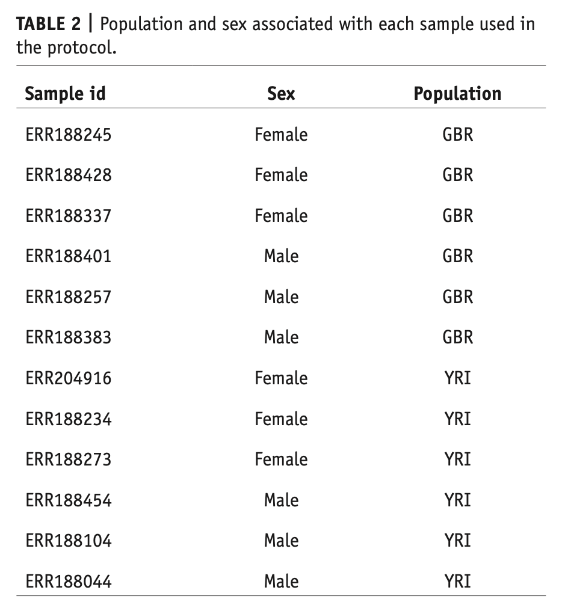
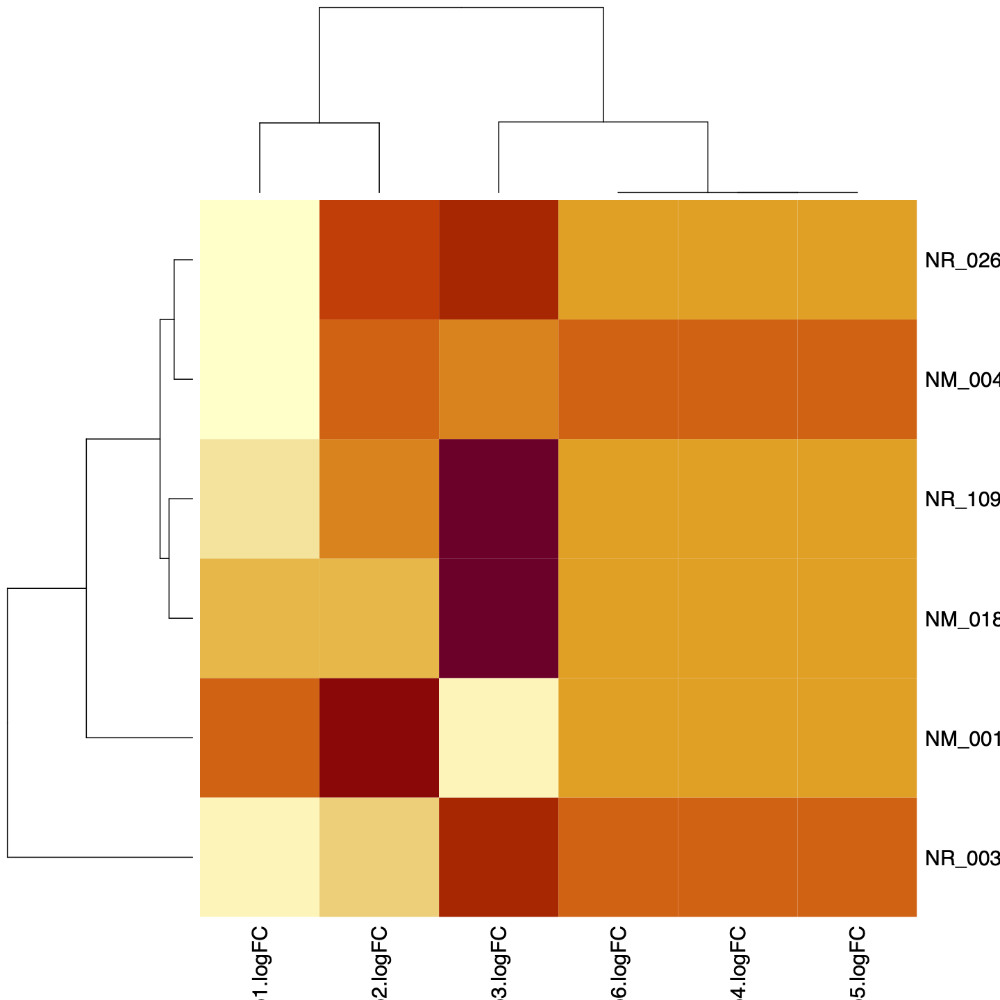

This week we will work with a RNA sequencing data set to analyze patterns of
differential expression of genes from human X chromosome.  This data sets is
described in this publication: [Pertea et al (2016)](data/Pertea_rnaseq_2016.pdf).

The data set itself can be downloaded here (**but you do not need to**):
[chrX_data.tar.gz](ftp://ftp.ccb.jhu.edu/pub/RNAseq_protocol/chrX_data.tar.gz)


<br><br>

## Table of Contents

- [1. Typical RNAseq Analysis Pipeline](#typical-rnaseq-analysis-pipeline)

- [2. Data Access](#data-access)

- [3. Data Cleanup](#data-cleanup)

- [4. Package Installation](#r-package-installation)

- [5. Import gene count data in EdgeR](#import-data-into-edger)

- [6. Filter For Low Expressing Genes](#filter-for-low-expressing-genes)

- [7. Normalize Expression Counts Across Samples](#normalize-expression-counts-across-samples)

- [8. Estimate Dispersion](#estimate-dispersion)

- [9. Pairwise Comparison Between Experimental Conditions](#pairwise-comparison-between-experimental-conditions)

	- [9.1 GBR Female vs GBR Male](#gbr-female-vs-gbr-male)
	
	- [9.2 GBR Female vs YRI Female](#gbr-female-vs-yri-female)
	
	- [9.3 GBR Male vs YRI Female](#gbr-male-vs-yri-female)

	- [9.4 GBR Male vs YRI Male](#gbr-male-vs-yri-male)

	- [9.5 GBR Female vs YRI Male](#gbr-female-vs-yri-male)

	- [9.6 YRI Female vs YRI Male](#yri-female-vs-yri-male)

- [10. Subset All Comparisons for the 7 Significant DE Genes](#subset-all-comparisons-for-the-7-significant-de-genes)

- [11. Make A Heatmap of logFC](#make-a-heatmap-of-logfc)

- [12. Homework](#homework)


<br><br><br><br><br><br><br><br>
<br><br><br><br><br><br><br><br>
<br><br><br><br><br><br><br><br>
<br><br><br><br><br><br><br><br>
<br><br><br><br><br><br><br><br>


## 1. Typical RNAseq Analysis Pipeline

Transcriptomic data from short-read sequencing technologies (e.g. Illumina
HiSeq) is analyzed in the following manner:

1. Obtain sequencing reads from service provider

2. Perform quality control to remove low quality sequencing reads

3. Obtain sequence data for a reference genome

4. Index the reference genome (so it can be efficiently searched for
homologies)

5. Align post-QC sequencing reads to the indexed reference genome

6. Identify transcripts/genes based on their homologies and locations in the
reference genome.

7. Calculate the transcript abundances in each sample under study and prepare a
table of gene and transcript counts.

8. Use regression analysis to determine which genes/transcripts are up and down
regulated.

9. Form hypotheses and test them using the differential expression results.

Because this is a R tutorial, we will not get into analysis steps 1 through 7.
Please consult the publication linked above for the details of those analyses.

We will begin with step #8 above.


## 2. Data Access

In any RNA sequencing experiment, there are two main types of data: genomic and
phenotypic.  The former comes from sequencing and counting transcripts/genes,
and the latter is trait data that will be used to make meaningful inferences
from the results.

### 2.1 Phenotypic Data

<center>

</center>

The data above can't be copy pasted.  It is an image.  We will need to create
this data frame in R manually.

<br><br>

1. First create 3 vectors

```r
sampid <- c("ERR188245", "ERR188428", "ERR188337", "ERR188401", "ERR188257",
"ERR188383", "ERR204916", "ERR188234", "ERR188273", "ERR188454", "ERR188104",
"ERR188044")


sex <- c(replicate(3, "Female"), replicate(3, "Male"), replicate(3, "Female"),
replicate(3, "Male"))

pop <- c(replicate(6, "GBR"), replicate(6, "YRI"))

```

<br><br>

2. Check to make sure all vectors are of same length

```r
length(sampid)
length(sex)
length(pop)
```


<br><br>

3. Creat a data frame by combining the three vectors as columns:

```r
pheno <- data.frame(sampid, sex, pop)

pheno

      sampid    sex pop
1  ERR188245 Female GBR
2  ERR188428 Female GBR
3  ERR188337 Female GBR
4  ERR188401   Male GBR
5  ERR188257   Male GBR
6  ERR188383   Male GBR
7  ERR204916 Female YRI
8  ERR188234 Female YRI
9  ERR188273 Female YRI
10 ERR188454   Male YRI
11 ERR188104   Male YRI
12 ERR188044   Male YRI
```

<br><br>

### 2.2 Gene Count Data

1. The gene count data for each sample can be downloaded here:
[gene_count_matrix.csv](data/gene_count_matrix.csv).  Once downloaded, import
the data into R:


```r
gc <- read.csv("gene_count_matrix.csv", header=TRUE)
```

2. What are the dimensions of this data frame?

```r
dim(gc)

[1] 2082   13
```

3. Check sample names to make sure they match the ``sampid`` from the ``pheno``
data you created above.

```r
names(gc)

 [1] "gene_id"   "ERR188044" "ERR188104" "ERR188234" "ERR188245" "ERR188257"
 [7] "ERR188273" "ERR188337" "ERR188383" "ERR188401" "ERR188428" "ERR188454"
[13] "ERR204916"

```

- Did you notice that the sample names are not in the same order in ``gc``
  compared to ``pheno``.  This is problematic. The analytical software we are
going to use requires that both files should have the same order for sample
names.  How do we fix this?

- We can either change the order in one or the other file.  In the pheno file,
  the order is appropriate for the analysis, which clearly shows replicates for
each experimental condition.  So we will keep that file as is and change ``gc``
instead.

```r
gc2 <- gc[,c("gene_id", sampid)]
```

- Note what did above.  We already have the correct order of samples in the
  vector ``sampid`` we created earlier.  So we simply substituted it and simply
pre-pended ``gene_id`` to that list.  Check to make sure that the new data
frame shows the data correctly:

```r
head(gc)

               gene_id ERR188044 ERR188104 ERR188234 ERR188245 ERR188257 ERR188273 ERR188337 ERR188383 ERR188401 ERR188428 ERR188454 ERR204916
1  NM_001177465|MAMLD1         0         0         0         0         0         0         0         0         0         0         0         0
2      NR_029427|WDR13         0         0        54       211       204        47       177       165       177       112       169       191
3   NM_001242640|BRCC3       401       495       574       520       614        83       737       304       737       313       358       312
4   NM_001303516|PDZD4         0         0         0         0         0         0         0         0         0         0         0         0
5 NM_001170757|FAM122B       865       470       462         0       271        94       342       295       342       306       403       127
6    NM_001185081|FMR1         0        95         0         0       346         0        82       294        82         0         0         0


head(gc2)

               gene_id ERR188245 ERR188428 ERR188337 ERR188401 ERR188257 ERR188383 ERR204916 ERR188234 ERR188273 ERR188454 ERR188104 ERR188044
1  NM_001177465|MAMLD1         0         0         0         0         0         0         0         0         0         0         0         0
2      NR_029427|WDR13       211       112       177       177       204       165       191        54        47       169         0         0
3   NM_001242640|BRCC3       520       313       737       737       614       304       312       574        83       358       495       401
4   NM_001303516|PDZD4         0         0         0         0         0         0         0         0         0         0         0         0
5 NM_001170757|FAM122B         0       306       342       342       271       295       127       462        94       403       470       865
6    NM_001185081|FMR1         0         0        82        82       346       294         0         0         0         0        95         0
```


- At this point our data sets should be ready for further steps.

<br><br>

## 3. Data Cleanup

- One thing you may have noticed is that we seem to have many genes where there
  is no data for any of the 12 samples.  These are the genes which read ``0``
in each of the 12 columns.  There is essentially no data here, so we need to
get rid of those rows.

```r
gc3 <- gc2[apply(gc2[c(2:13)], 1, function(x) !any(x == 0)),]

dim(gc3)

[1] 656  13

head(gc3)

              gene_id ERR188245 ERR188428 ERR188337 ERR188401 ERR188257 ERR188383 ERR204916 ERR188234 ERR188273 ERR188454 ERR188104 ERR188044
3  NM_001242640|BRCC3       520       313       737       737       614       304       312       574        83       358       495       401
7     NM_001356|DDX3X       203       336       312       312       239        37       129       432        44        32       879       102
13     NM_000489|ATRX      1260      3278      3919      3919      4098      3632      4259      1946      1692      2501      5921      4909
22      NM_000116|TAZ       207       282       562       562       286       389       468       598       130       263       430       432
23    NM_016024|RBMX2      1072      1164      1849      1849      1356      1752      1430      1453       765      1292      1843      1626
28   NR_029635|MIR221         1         2         8         8         5         2         3         3         2         2        10         6
```

- What we did above is to remove rows containing only 0s for columns 2 through
  14 in the data set. But instead of saving it in the same data frame, we sent
output to a new frame called ``gc3``.  We now have 656 rows of data, which
means 1426 rows had no data, so we discarded them.

- Let's write this data frame to disk

```r
write.table(gc3, "gene_count_matrix_final.txt", row.names=F, col.names=T,
quote=F, sep='\t')
```

- Verify that the file was written correctly by opening in a text editor.


<br><br>

## 4. R Package Installation

For this exercise, we will use the Bioconductor package
[EdgeR](https://bioconductor.org/packages/release/bioc/html/edgeR.html).  click
on the link which will take you to the instructions for installing this
package.

Bioconductor is a repository for packages used in biological data analysis. It
has a different system for installing packages.


```r
if (!requireNamespace("BiocManager", quietly = TRUE))
    install.packages("BiocManager")

BiocManager::install("edgeR")
```

- Load the package

```r
library(edgeR)
```

- Package documentation is available [here](https://bioconductor.org/packages/release/bioc/vignettes/edgeR/inst/doc/edgeRUsersGuide.pdf)


<br><br>


## 5. Import data in EdgeR

In our current data frame, the gene name appear in their own column. EdgeR
prefers to have this data as row names.  


<br>

### 5.1 Import count data

```r
ct <- read.table("gene_count_matrix_Final.txt", header=TRUE, row.names="gene_id")

head(ct)

                   ERR188245 ERR188428 ERR188337 ERR188401 ERR188257 ERR188383 ERR204916 ERR188234 ERR188273 ERR188454 ERR188104 ERR188044
NM_001242640|BRCC3       520       313       737       737       614       304       312       574        83       358       495       401
NM_001356|DDX3X          203       336       312       312       239        37       129       432        44        32       879       102
NM_000489|ATRX          1260      3278      3919      3919      4098      3632      4259      1946      1692      2501      5921      4909
NM_000116|TAZ            207       282       562       562       286       389       468       598       130       263       430       432
NM_016024|RBMX2         1072      1164      1849      1849      1356      1752      1430      1453       765      1292      1843      1626
NR_029635|MIR221           1         2         8         8         5         2         3         3         2         2        10         6
```

- Notice how the ``gene_id`` column has now been converted into row names.


<br>

### 5.2 Create factors to describe phenotypic data

- Next, we need to create factors for our phenotypic data.  Our phenotypes
  consist of two sexes from each of the two populations with three replicates
from each.  So we have four factors.

```r
group <- factor(c(1,1,1,2,2,2,3,3,3,4,4,4))

group

 [1] 1 1 1 2 2 2 3 3 3 4 4 4

Levels: 1 2 3 4
```

<br>

### 5.3 Create Differential Gene Expression List

```r
y <- DGEList(counts=ct, group=group)

y

An object of class "DGEList"
$counts
                   ERR188245 ERR188428 ERR188337 ERR188401 ERR188257 ERR188383 ERR204916 ERR188234 ERR188273 ERR188454 ERR188104 ERR188044
NM_001242640|BRCC3       520       313       737       737       614       304       312       574        83       358       495       401
NM_001356|DDX3X          203       336       312       312       239        37       129       432        44        32       879       102
NM_000489|ATRX          1260      3278      3919      3919      4098      3632      4259      1946      1692      2501      5921      4909
NM_000116|TAZ            207       282       562       562       286       389       468       598       130       263       430       432
NM_016024|RBMX2         1072      1164      1849      1849      1356      1752      1430      1453       765      1292      1843      1626
651 more rows ...

$samples
          group lib.size norm.factors
ERR188245     1  1348647            1
ERR188428     1  1344702            1
ERR188337     1  2098602            1
ERR188401     2  2098602            1
ERR188257     2  1501213            1
7 more rows ...
```

<br><br>


## 6. Filter For Low Expressing Genes 

You may recall that earlier in this process we had removed genes which had no
data.  But there may still be some genes left in the data with very few counts.
Since we will be normalizing count data, such low expression genes might skew
our estimates.  So we will remove them at this stage.

- First assign a function within EdgeR library called ``filterByExpr()`` to a
  keyword ``keep`` for ease of use.

```r
keep <- filterByExpr(y)
```

- Let the filtering proceed. We 

```r
yfilt <- y[keep, , keep.lib.sizes=FALSE]

yfilt

An object of class "DGEList"
$counts
                   ERR188245 ERR188428 ERR188337 ERR188401 ERR188257 ERR188383 ERR204916 ERR188234 ERR188273 ERR188454 ERR188104 ERR188044
NM_001242640|BRCC3       520       313       737       737       614       304       312       574        83       358       495       401
NM_001356|DDX3X          203       336       312       312       239        37       129       432        44        32       879       102
NM_000489|ATRX          1260      3278      3919      3919      4098      3632      4259      1946      1692      2501      5921      4909
NM_000116|TAZ            207       282       562       562       286       389       468       598       130       263       430       432
NM_016024|RBMX2         1072      1164      1849      1849      1356      1752      1430      1453       765      1292      1843      1626
640 more rows ...

$samples
          group lib.size norm.factors
ERR188245     1  1348614            1
ERR188428     1  1344673            1
ERR188337     1  2098545            1
ERR188401     2  2098545            1
ERR188257     2  1501166            1
7 more rows ...

```

- The filtering function as applied here only keeps those genes that have
  worthwhile counts in a minimum number of samples. This number of samples is
computed from the factors we had created earlier. In our case, that number is
``3`` - the group size (3 replicates per condition).

- The ``keep.lib.sizes=FALSE`` option allows EdgeR to recalculate the library
  size (total number of reads in each sample) after such low count genes have
been removed.  The opposite of this would be setting this option to ``TRUE``
and may lead to discrepancies.

<br><br>


## 7. Normalize Expression Counts Across Samples

- Normalizing libraries between samples is essential to getting accurate
  downstream results.

```r
ynorm <- calcNormFactors(yfilt)

ynorm$samples

          group lib.size norm.factors
ERR188245     1  1348614    0.9683824
ERR188428     1  1344673    0.9242010
ERR188337     1  2098545    1.0695881
ERR188401     2  2098545    1.0695881
ERR188257     2  1501166    1.0594384
ERR188383     2  1530767    1.0352421
ERR204916     3  1697815    1.0025118
ERR188234     3  2419080    0.9015856
ERR188273     3   917517    0.9375173
ERR188454     4  1600884    1.0658455
ERR188104     4  1988270    1.0055686
ERR188044     4  2063117    0.9805151
```

<br><br>

## 8. Estimate Dispersion

- Differential gene expression analysis uses generalized linear models. It
  becomes necessary to understand how much gene expression varies in different
samples from a mean of all samples.  That estimate is called dispersion.

```r
ydisp <- estimateDisp(ynorm)

ydisp

An object of class "DGEList"
$counts
                   ERR188245 ERR188428 ERR188337 ERR188401 ERR188257 ERR188383 ERR204916 ERR188234 ERR188273 ERR188454 ERR188104 ERR188044
NM_001242640|BRCC3       520       313       737       737       614       304       312       574        83       358       495       401
NM_001356|DDX3X          203       336       312       312       239        37       129       432        44        32       879       102
NM_000489|ATRX          1260      3278      3919      3919      4098      3632      4259      1946      1692      2501      5921      4909
NM_000116|TAZ            207       282       562       562       286       389       468       598       130       263       430       432
NM_016024|RBMX2         1072      1164      1849      1849      1356      1752      1430      1453       765      1292      1843      1626
640 more rows ...

$samples
          group lib.size norm.factors
ERR188245     1  1348614    0.9683824
ERR188428     1  1344673    0.9242010
ERR188337     1  2098545    1.0695881
ERR188401     2  2098545    1.0695881
ERR188257     2  1501166    1.0594384
7 more rows ...

$common.dispersion
[1] 0.226083

$trended.dispersion
[1] 0.2841544 0.3252375 0.1064144 0.2970612 0.1550413
640 more elements ...

$tagwise.dispersion
[1] 0.14545759 0.71584346 0.14771572 0.11178168 0.04818607
640 more elements ...

$AveLogCPM
[1]  8.012388  7.168844 10.977294  7.764692  9.739103
640 more elements ...

$trend.method
[1] "locfit"

$prior.df
[1] 2.607188

$prior.n
[1] 0.3258985

$span
[1] 0.4588173
```

<br><br>

## 9. Pairwise Comparison Between Experimental Conditions

- Finally, we are ready to perform differential gene expression analysis.  Let's
take a quick look at our phenotypic data to decide which pair to try first.


```r
pheno

      sampid    sex pop
1  ERR188245 Female GBR
2  ERR188428 Female GBR
3  ERR188337 Female GBR
4  ERR188401   Male GBR
5  ERR188257   Male GBR
6  ERR188383   Male GBR
7  ERR204916 Female YRI
8  ERR188234 Female YRI
9  ERR188273 Female YRI
10 ERR188454   Male YRI
11 ERR188104   Male YRI
12 ERR188044   Male YRI
```

<br>

### 9.1 GBR Female vs GBR Male

- According to our group factors, these are groups 1 and 2. How can we verify
  this?

```r
levels(ydisp$samples$group)

[1] "1" "2" "3" "4"

rownames(ydisp$samples)[1:4]
[1] "ERR188245" "ERR188428" "ERR188337" "ERR188401"
```

- Cross check to make sure that the ``ERR`` library names match between the
  pheno files for the phenotypes we are selecting.

- Then use Fisher's Exact test to estimate DEGs for this pair of samples.

```r
GBR_MF <- exactTest(ydisp, pair=c(1,2))

GBR_MF

An object of class "DGEExact"
$table
                         logFC    logCPM    PValue
NM_001242640|BRCC3 -0.11039010  8.012388 0.8097677
NM_001356|DDX3X    -0.85210878  7.168844 0.4124643
NM_000489|ATRX      0.30650253 10.977294 0.5020825
NM_000116|TAZ       0.08702188  7.764692 0.8299446
NM_016024|RBMX2     0.10799335  9.739103 0.6799526
640 more rows ...

$comparison
[1] "1" "2"

$genes
NULL
```

- You will notice in the table that we have three types of values.

	- ``logFC`` is log fold change, a metric of how different gene
	  expression is between the samples
	- ``logCPM`` is the log of counts per million (you can disregard this
	  for now)
	- ``PValue`` is your standard measure of significance from Fisher's
	  exact test.

- Doing multiple testing and simply using P values for inference may lead to
  spurious false positives and/or false negatives. 

- To make our results more robust, we will estimate ``FDR`` or False Discovery
  Rate which is preferable to using Pvalues.


```r
GBR_MF_FDR <- topTags(GBR_MF, n=Inf)

head(GBR_MF_FDR)

Comparison of groups:  2-1 
                        logFC    logCPM       PValue        FDR
NR_003255|TSIX     -5.3282667  8.731971 4.682312e-05 0.03020091
NM_004187|KDM5C    -0.6818842 10.926060 1.801629e-02 1.00000000
NR_132647|AIFM1     1.6119246  5.374244 2.130455e-02 1.00000000
NM_001282622|KDM5C -0.6675069 10.949292 2.165767e-02 1.00000000
NR_033699|FMR1      1.3293297  7.244091 2.210837e-02 1.00000000
NM_001281463|SMC1A  4.2982844  8.333749 2.417667e-02 1.00000000
```

- Write this data to a file

```r
write.table(GBR_MF_FDR, "GBR_MF_FDR.txt", row.names=T, col.names=T, quote=F, sep='\t')
```


- Which genes are significant for DE?

```r
sum(GBR_MF_FDR$table$FDR <= 0.05)
[1] 1
```

- That's shocking. One one significant gene: ``NR_003255|TSIX``. Let's do one
  more pairwise comparison.


<br>

### 9.2 GBR Female vs YRI Female

- These would be for groups 1 and 3.


```r
GBRF_YRIF <- exactTest(ydisp, pair=c(1,3))

GBRF_YRIF
```

```r
GBRF_YRIF_FDR <- topTags(GBRF_YRIF, n=Inf)

sum(GBRF_YRIF_FDR$table$FDR <= 0.05)

[1] 0
```

- It seems that there are no significant DE genes in this pair either. This may
  indicate problems with the analysis upstream of what we have done today. Just
to be sure, let's try one more pair.

<br>

### 9.3 GBR Male vs YRI Female

```r
GBRM_YRIF <- exactTest(ydisp, pair=c(2,3))

GBRM_YRIF
```

```r
GBRM_YRIF_FDR <- topTags(GBRM_YRIF, n=Inf)

sum(GBRM_YRIF_FDR$table$FDR <= 0.05)

[1] 6
```

- There are six genes in this comparison that are significant.  What are they?

```r
subset(GBRM_YRIF_FDR$table, FDR <= 0.05)

                       logFC    logCPM       PValue         FDR
NR_003255|TSIX      6.274395  8.731971 4.195616e-06 0.002706173
NR_026595|FAM226A   2.404004  4.684012 2.161911e-05 0.004897595
NM_004187|KDM5C     1.232794 10.926060 2.277951e-05 0.004897595
NM_001306145|MTMR1 -3.476830  4.682143 5.607137e-05 0.009041509
NM_018390|PLCXD1    1.486596 11.132709 1.025941e-04 0.013234645
NR_109776|ARHGAP6   2.798704  2.504785 1.807483e-04 0.019430437
```

<br>

### 9.4 GBR Male vs YRI Male

```r
GBRM_YRIM <- exactTest(ydisp, pair=c(2,4))

GBRM_YRIM
```

```r
GBRM_YRIM_FDR <- topTags(GBRM_YRIM, n=Inf)

sum(GBRM_YRIM_FDR$table$FDR <= 0.05)

[1] 0
```


<br>

### 9.5 GBR Female vs YRI Male


```r
GBRF_YRIM <- exactTest(ydisp, pair=c(2,4))

GBRF_YRIM
```

```r
GBRF_YRIM_FDR <- topTags(GBRF_YRIM, n=Inf)

sum(GBRF_YRIM_FDR$table$FDR <= 0.05)

[1] 0
```

<br>

### 9.6 YRI Female vs YRI Male

```r
YRIF_YRIM <- exactTest(ydisp, pair=c(2,4))

YRIF_YRIM
```

```r
YRIF_YRIM_FDR <- topTags(YRIF_YRIM, n=Inf)

sum(YRIF_YRIM_FDR$table$FDR <= 0.05)

[1] 0
```

<br><br>

## 10. Subset All Comparisons for the 6 Significant DE Genes

- First create a simple vector containing names of those 6 genes.

```r
genes <- c("NR_003255|TSIX", "NR_026595|FAM226A", "NM_004187|KDM5C",
"NM_001306145|MTMR1", "NM_018390|PLCXD1", "NR_109776|ARHGAP6")
```

```r
sub1 <- subset(GBR_MF_FDR$table, rownames(GBR_MF_FDR$table) %in% genes)
sub2 <- subset(GBRF_YRIF_FDR$table, rownames(GBRF_YRIF_FDR$table) %in% genes)
sub3 <- subset(GBRM_YRIF_FDR$table, rownames(GBRM_YRIF_FDR$table) %in% genes)
sub4 <- subset(GBRM_YRIM_FDR$table, rownames(GBRM_YRIM_FDR$table) %in% genes)
sub5 <- subset(GBRF_YRIM_FDR$table, rownames(GBRF_YRIM_FDR$table) %in% genes)
sub6 <- subset(YRIF_YRIM_FDR$table, rownames(YRIF_YRIM_FDR$table) %in% genes)
```

- Second, extract the logFC column from each and put into a single data frame.

```r
logFC <- data.frame(sub1$logFC, sub2$logFC, sub3$logFC, sub4$logFC, sub5$logFC, sub6$logFC)

rownames(logFC) <- genes

logFC
                   sub1.logFC sub2.logFC sub3.logFC sub4.logFC sub5.logFC sub6.logFC
NR_003255|TSIX     -5.3282667 -3.0164320   6.274395  2.5758704  2.5758704  2.5758704
NR_026595|FAM226A  -0.6818842  2.1898706   2.404004  1.1532322  1.1532322  1.1532322
NM_004187|KDM5C    -0.5414571  1.5945215   1.232794  1.3553918  1.3553918  1.3553918
NM_001306145|MTMR1 -0.8092117  0.9451367  -3.476830 -1.7765739 -1.7765739 -1.7765739
NM_018390|PLCXD1    0.4589596  0.5509091   1.486596  0.5849666  0.5849666  0.5849666
NR_109776|ARHGAP6  -0.6058542  0.9461587   2.798704  0.4847461  0.4847461  0.4847461

```

<br><br>

## 11. Make A Heatmap of logFC

- Convert logFC data frame to a matrix

```r
logFCm <- as.matrix(logFC)
```

- Draw a heat map

```r
par(mar=c(5,4,4,4), oma=c(6,5,5,5))

pdf("heatmap_chrX.pdf", width=10, height=10)

heatmap(logFCm)

dev.off()

```

<center>

</center>


<br><br>

## 12. Homework

1. Make a Github repository named ``rnaseq_chrX``

2. Recreate the heat map figure using ``heatmap.2()`` function in R

3. Write a short paragraph explaining what this heat map is showing or not
showing

4. Create a new markdown file with this paragraph and the heatmap figure.

5. Push it to your GitHub repository

6. Post GitHub repo URL to #livecoding channel on Slack


<br><br><br><br>
<br><br><br><br>
<br><br><br><br>
<br><br><br><br>
